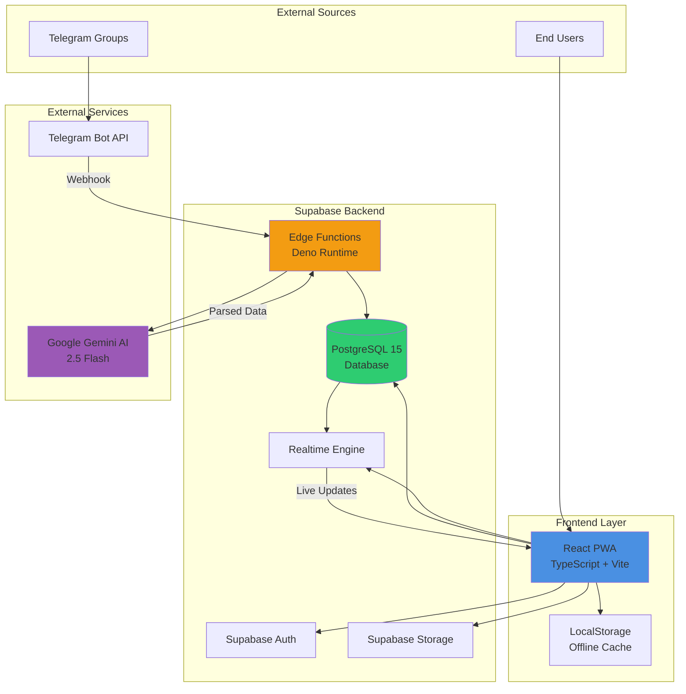
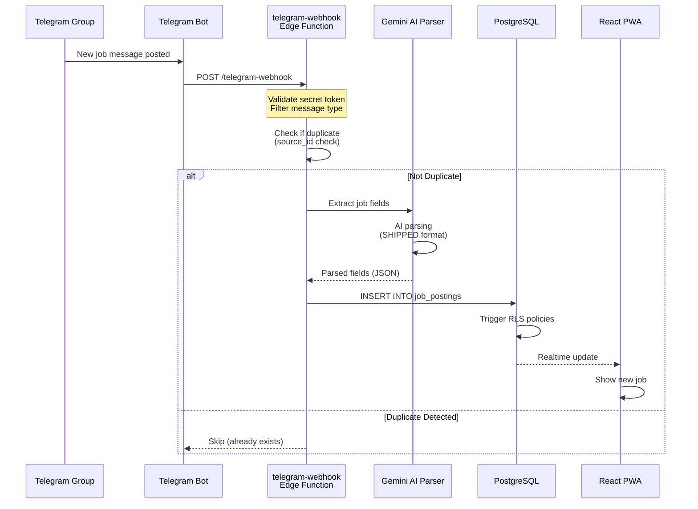
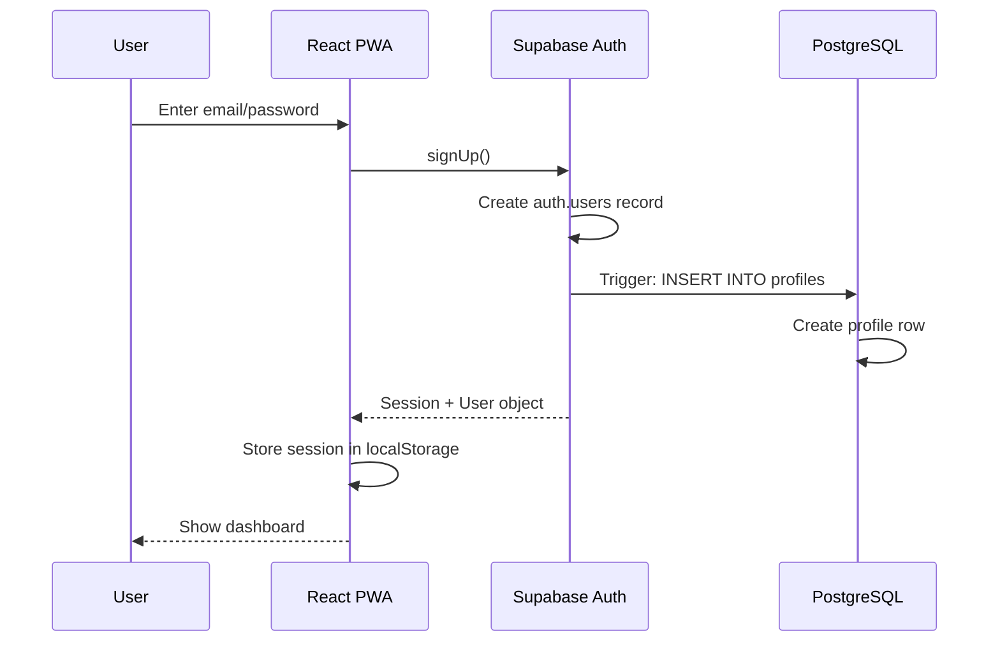
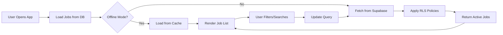
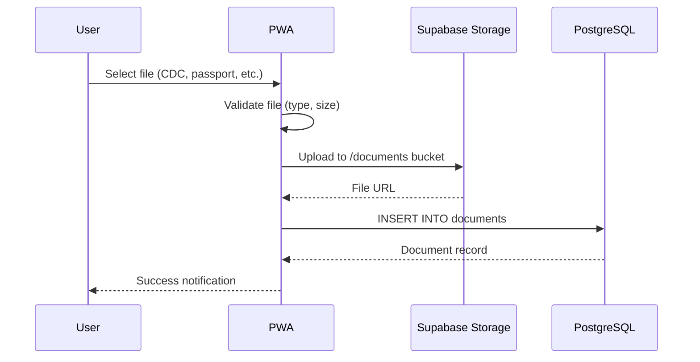

# Technical Architecture

**Path**: `docs/02-technical-architecture.md`
**Last Updated**: February 14, 2026
**Related**: [Tech Stack](04-tech-stack.md) | [Database Schema](05-database-schema.md) | [API Reference](06-api-reference.md)

---

## Table of Contents
- [System Overview](#system-overview)
- [Architecture Diagram](#architecture-diagram)
- [Frontend Architecture](#frontend-architecture)
- [Backend Architecture](#backend-architecture)
- [Data Flow](#data-flow)
- [Security Architecture](#security-architecture)
- [Deployment Architecture](#deployment-architecture)

---

## System Overview

BD Mariner Hub is built as a modern **Progressive Web Application (PWA)** using a serverless architecture. The system follows a three-tier architecture pattern:

1. **Frontend**: React-based PWA with offline-first capabilities
2. **Backend**: Supabase Edge Functions (serverless) + PostgreSQL database
3. **Integrations**: Telegram Bot API, Google Gemini AI

**Architecture Pattern**: Serverless + JAMstack
**Deployment Model**: Cloud-native (Supabase, Vercel)
**Data Strategy**: Offline-first with real-time sync

###Key Architectural Decisions

| Decision | Choice | Rationale |
|----------|--------|-----------|
| **Backend Platform** | Supabase | Real-time capabilities, built-in auth, PostgreSQL, Edge Functions, RLS policies |
| **Frontend Framework** | React 18 + TypeScript | Component reusability, type safety, large ecosystem |
| **Build Tool** | Vite | Fast HMR, optimized builds, modern tooling |
| **Database** | PostgreSQL 15 | ACID compliance, JSONB support, powerful querying, mature |
| **AI Processing** | Google Gemini 2.5 Flash | High accuracy, cost-effective, fast inference |
| **Telegram Integration** | Bot API (Webhook) | Official API, reliable, no phone number required |
| **State Management** | React Context + Hooks | Sufficient for current complexity, no external library needed |
| **Styling** | Tailwind CSS | Utility-first, rapid development, consistent design |

---

## Architecture Diagram

### High-Level System Architecture



### Job Ingestion Pipeline



---

## Frontend Architecture

### Component Structure

```
src/
├── components/
│   ├── JobBoard.tsx          # Main job listing component
│   ├── AIChat.tsx             # Gemini AI chat interface
│   ├── DocumentManager.tsx    # Document upload/management
│   ├── SeaServiceTracker.tsx  # Sea service history
│   ├── MedicalCenters.tsx     # DG-approved medical centers
│   ├── ManningAgents.tsx      # Agency directory
│   ├── AdminDashboard.tsx     # Admin panel
│   ├── AlumniAssociation.tsx  # Alumni features
│   └── CommunityForum.tsx     # Discussion forum
│
├── hooks/
│   ├── useAuth.ts             # Authentication hook
│   ├── useJobs.ts             # Job data fetching
│   └── useRealtime.ts         # Realtime subscriptions
│
├── types.ts                   # TypeScript interfaces
├── supabaseClient.ts          # Supabase client config
└── App.tsx                    # Root component
```

### State Management

**Approach**: React Context API + Custom Hooks

```typescript
// Authentication Context
AuthContext
├── user: User | null
├── session: Session | null
├── signIn()
├── signOut()
└── updateProfile()

// App Context
AppContext
├── activeTab: TabName
├── setActiveTab()
├── notifications: Notification[]
└── addNotification()
```

### Offline-First Strategy

1. **Service Worker**: Caches static assets and API responses
2. **Local Storage**: Stores user preferences and recently viewed jobs
3. **IndexedDB**: Caches job listings for offline browsing
4. **Background Sync**: Syncs user actions when connection restored

```typescript
// PWA Manifest (metadata.json)
{
  "name": "BD Mariner Hub",
  "short_name": "Mariner Hub",
  "start_url": "/",
  "display": "standalone",
  "background_color": "#ffffff",
  "theme_color": "#1E40AF",
  "offline_enabled": true
}
```

---

## Backend Architecture

### Supabase Edge Functions

**Runtime**: Deno (V8-based, secure by default)
**Language**: TypeScript
**Deployment**: Serverless (auto-scaling)

**Functions**:

1. **telegram-webhook** (`/functions/v1/telegram-webhook`)
   - Receives Telegram webhooks
   - Validates secret token
   - Filters job messages
   - Checks for duplicates
   - Invokes AI parser
   - Inserts into database

2. **job-parser** (Internal - called by telegram-webhook)
   - Calls Gemini AI API
   - Extracts SHIPPED format fields
   - Retry logic (max 3 attempts)
   - Returns structured JSON

3. **cdc-verify** (`/functions/v1/cdc-verify`)
   - Verifies CDC numbers
   - Checks against authorized doctors list
   - Returns validation status

### Database Architecture

**Engine**: PostgreSQL 15
**Hosting**: Supabase (managed)
**Features Used**:
- JSONB columns for flexible data
- Full-text search (tsvector)
- Row-Level Security (RLS)
- Materialized views
- Triggers and functions
- Foreign key constraints

**Key Design Patterns**:
- **Soft Deletes**: Records marked as deleted, not removed
- **Audit Trails**: created_at, updated_at timestamps
- **JSONB for Flexibility**: parsed_content, sea_service_history
- **Materialized Views**: `active_jobs` for performance
- **RLS Policies**: User data isolation

---

## Data Flow

### User Registration & Authentication Flow



### Job Discovery Flow



### Document Upload Flow



---

## Security Architecture

### Row-Level Security (RLS) Policies

**Principle**: Users can only access their own data (except public resources)

**Examples**:

```sql
-- Profiles: Users can only view/update their own profile
CREATE POLICY "Users can view own profile"
ON profiles FOR SELECT
USING (auth.uid() = id);

-- Documents: Private to owner
CREATE POLICY "Users can view own documents"
ON documents FOR SELECT
USING (auth.uid() = user_id);

-- Job Postings: Public read, admin write
CREATE POLICY "Anyone can view active jobs"
ON job_postings FOR SELECT
USING (status = 'active');

-- Forum Posts: Public read, authenticated write
CREATE POLICY "Authenticated users can create posts"
ON forum_posts FOR INSERT
WITH CHECK (auth.role() = 'authenticated');
```

### API Security

1. **Authentication**: Supabase JWT tokens
2. **Authorization**: RLS policies at database level
3. **Webhook Validation**: Secret token verification
4. **CORS**: Restricted to app domain
5. **Rate Limiting**: Supabase built-in (future: custom limits)

### Data Protection

- **Encryption at Rest**: Supabase default encryption
- **Encryption in Transit**: HTTPS/TLS for all connections
- **Secrets Management**: Supabase environment variables (not in code)
- **API Keys**: Restricted to backend only (not exposed to client)

---

## Deployment Architecture

### Production Environment

```
┌─────────────────────────────────────────────┐
│  Cloudflare CDN (Optional Future)           │
│  - Static asset caching                     │
│  - DDoS protection                          │
└─────────────────┬───────────────────────────┘
                  │
┌─────────────────▼───────────────────────────┐
│  Frontend Hosting                           │
│  Platform: Vercel / Netlify / Self-hosted  │
│  - React PWA static files                   │
│  - Auto-deploy from GitHub                  │
│  - Environment variables                    │
└─────────────────┬───────────────────────────┘
                  │
                  │ API Calls
                  │
┌─────────────────▼───────────────────────────┐
│  Supabase Cloud                             │
│  ├── PostgreSQL 15 Database                │
│  ├── Edge Functions (Deno)                 │
│  ├── Supabase Auth                         │
│  ├── Supabase Storage                      │
│  └── Realtime Engine                       │
└─────────────────┬───────────────────────────┘
                  │
        ┌─────────┴──────────┐
        │                    │
┌───────▼────────┐  ┌────────▼───────┐
│  Telegram API  │  │  Gemini AI API │
│  - Webhooks    │  │  - Job Parsing │
│  - Bot updates │  │  - AI Chat     │
└────────────────┘  └────────────────┘
```

### Development Environment

- **Local**: Vite dev server (http://localhost:5173)
- **Database**: Supabase cloud (shared dev project) OR local Supabase CLI
- **Environment Variables**: `.env.local` (not committed)
- **Hot Reload**: Vite HMR for instant updates

### CI/CD Pipeline

**Current**: Manual deployment
**Planned**:
```
GitHub Push (main branch)
    ↓
GitHub Actions Workflow
    ├── Run Tests
    ├── Build React App
    ├── Deploy Edge Functions
    ├── Run Database Migrations
    └── Deploy Frontend to Vercel
    ↓
Production Live
```

---

## Performance Optimizations

### Frontend Optimizations
- **Code Splitting**: Lazy load components
- **Image Optimization**: WebP format, lazy loading
- **Bundle Size**: Tree shaking, minification
- **Caching**: Service worker for static assets
- **Virtual Scrolling**: For long job lists (future)

### Backend Optimizations
- **Database Indexing**: On frequently queried columns
- **Materialized Views**: `active_jobs` for fast queries
- **Connection Pooling**: Supabase manages connection pool
- **Edge Functions**: Auto-scaling based on load
- **CDN**: For static assets (future)

### Query Optimizations
```sql
-- Index on status and created_at for fast job listing
CREATE INDEX idx_job_postings_active
ON job_postings(status, created_at DESC)
WHERE status = 'active';

-- Full-text search index
CREATE INDEX idx_job_postings_search
ON job_postings USING gin(to_tsvector('english', source_text));
```

---

## Scalability Considerations

### Current Capacity
- **Users**: 10,000 MAU (estimated)
- **Job Postings**: 1,000+ per month
- **Database Size**: <1 GB
- **Edge Functions**: Auto-scale (serverless)

### Future Scaling Strategy
- **Database**: Upgrade Supabase tier, read replicas
- **Edge Functions**: Already serverless (infinite scale)
- **Frontend**: CDN distribution (Cloudflare)
- **Storage**: Object storage for documents (Supabase Storage scales)
- **Caching**: Redis layer for hot data (future)

---

## Monitoring & Observability

### Current Monitoring
- **Supabase Dashboard**: DB metrics, function logs
- **Browser DevTools**: Frontend errors
- **Manual Testing**: User feedback

### Planned Monitoring
- **Error Tracking**: Sentry integration
- **Analytics**: Google Analytics 4, Mixpanel
- **Uptime Monitoring**: Ping checks, status page
- **Log Aggregation**: Centralized logging
- **Performance Monitoring**: Core Web Vitals tracking

---

## Related Documentation
- **[Tech Stack](04-tech-stack.md)** - Detailed technology choices
- **[Database Schema](05-database-schema.md)** - Complete schema documentation
- **[API Reference](06-api-reference.md)** - API endpoints and usage
- **[Integrations](07-integrations.md)** - External service connections
- **[Deployment Guide](../DEPLOYMENT_GUIDE.md)** - Production deployment steps

---

**Next**: [Features Overview](03-features.md)
