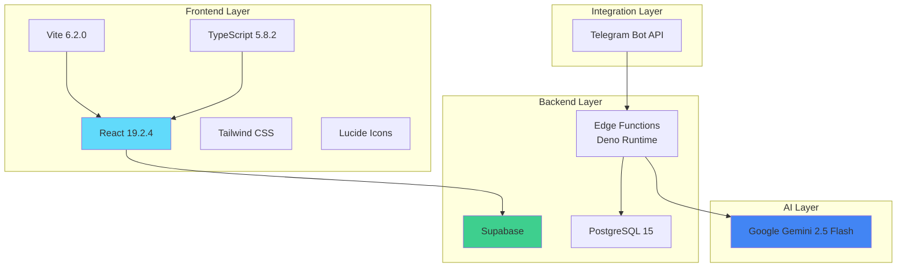

# Tech Stack

**Path**: `docs/04-tech-stack.md`
**Last Updated**: February 14, 2026
**Related**: [Technical Architecture](02-technical-architecture.md) | [Database Schema](05-database-schema.md) | [API Reference](06-api-reference.md)

---

## Table of Contents
- [Technology Overview](#technology-overview)
- [Frontend Stack](#frontend-stack)
- [Backend Stack](#backend-stack)
- [AI & Machine Learning](#ai--machine-learning)
- [Development Tools](#development-tools)
- [Deployment & Infrastructure](#deployment--infrastructure)
- [External Services](#external-services)
- [Technology Rationale](#technology-rationale)

---

## Technology Overview

BD Mariner Hub is built using a modern, serverless-first technology stack optimized for rapid development, scalability, and cost-effectiveness.

**Architecture Pattern**: JAMstack + Serverless
**Philosophy**: Cloud-native, offline-first, AI-powered
**Development Speed**: Fast iteration with minimal infrastructure management

### Stack at a Glance



---

## Frontend Stack

### Core Framework

#### React 19.2.4
**Purpose**: UI framework for building component-based interfaces
**Website**: https://react.dev

**Why React?**
- Component reusability across the app
- Large ecosystem of libraries and tools
- Strong community support
- Excellent documentation
- Familiar to most developers

**Key Features Used**:
- Hooks (useState, useEffect, useContext)
- Context API for state management
- Functional components
- Custom hooks for data fetching

**Example Usage**:
```typescript
import { useState, useEffect } from 'react';
import { supabase } from './supabaseClient';

function JobBoard() {
  const [jobs, setJobs] = useState([]);

  useEffect(() => {
    fetchJobs();
  }, []);

  const fetchJobs = async () => {
    const { data } = await supabase
      .from('job_postings')
      .select('*')
      .eq('status', 'active');
    setJobs(data);
  };

  return <div>{/* Job listings */}</div>;
}
```

---

### Build Tool

#### Vite 6.2.0
**Purpose**: Fast build tool and dev server
**Website**: https://vitejs.dev

**Why Vite?**
- Lightning-fast Hot Module Replacement (HMR)
- Optimized production builds
- Native ESM support
- Minimal configuration required
- Tree-shaking for smaller bundles

**Configuration** (`vite.config.js`):
```javascript
import { defineConfig } from 'vite';
import react from '@vitejs/plugin-react';

export default defineConfig({
  plugins: [react()],
  build: {
    outDir: 'dist',
    sourcemap: true
  },
  server: {
    port: 5173
  }
});
```

**Build Performance**:
- Dev server startup: <1 second
- Hot reload: <50ms
- Production build: ~10 seconds
- Bundle size: ~300KB (gzipped)

---

### Type Safety

#### TypeScript 5.8.2
**Purpose**: Static type checking for JavaScript
**Website**: https://www.typescriptlang.org

**Why TypeScript?**
- Catch errors at compile time, not runtime
- Better IDE autocomplete and intellisense
- Self-documenting code through types
- Easier refactoring
- Improved developer experience

**Type Definitions** (`src/types.ts`):
```typescript
export interface JobPosting {
  id: string;
  source: 'telegram' | 'manual' | 'whatsapp';
  source_id?: string;
  raw_content: string;
  parsed_content: ParsedJobContent;
  status: 'pending' | 'active' | 'filled' | 'expired';
  created_at: string;
  updated_at: string;
}

export interface ParsedJobContent {
  rank?: string;
  salary?: string;
  joining_date?: string;
  agency?: string;
  mla_number?: string;
  agency_address?: string;
  mobile_number?: string;
  agency_email?: string;
}

export interface UserProfile {
  id: string;
  email: string;
  first_name?: string;
  last_name?: string;
  rank?: string;
  cdc_number?: string;
  sea_service_history: SeaServiceRecord[];
}

export interface SeaServiceRecord {
  vessel_name: string;
  vessel_type: string;
  rank: string;
  sign_on: string;
  sign_off: string;
  duration_days: number;
}
```

**TypeScript Features Used**:
- Interfaces for data structures
- Type aliases for unions
- Generics for reusable components
- Strict null checks
- Readonly properties

---

### Styling

#### Tailwind CSS 3.4+
**Purpose**: Utility-first CSS framework
**Website**: https://tailwindcss.com

**Why Tailwind?**
- Rapid UI development
- Consistent design system
- No CSS naming conflicts
- Responsive design built-in
- Small production bundle (purged unused styles)

**Example Component Styling**:
```tsx
<div className="bg-white rounded-lg shadow-md p-6 hover:shadow-lg transition-shadow">
  <h2 className="text-xl font-bold text-gray-900 mb-4">
    Chief Engineer
  </h2>
  <div className="flex items-center gap-2 text-sm text-gray-600">
    <span className="bg-blue-100 text-blue-800 px-3 py-1 rounded-full">
      $8,500/month
    </span>
    <span className="bg-green-100 text-green-800 px-3 py-1 rounded-full">
      Active
    </span>
  </div>
</div>
```

**Tailwind Configuration**:
```javascript
module.exports = {
  content: ['./index.html', './src/**/*.{js,ts,jsx,tsx}'],
  theme: {
    extend: {
      colors: {
        primary: '#1E40AF',
        secondary: '#64748B'
      }
    }
  },
  plugins: []
};
```

---

### Icons

#### Lucide React 0.563.0
**Purpose**: Beautiful, consistent SVG icons
**Website**: https://lucide.dev

**Why Lucide?**
- Clean, modern icon design
- Tree-shakeable (only import what you use)
- Consistent size and stroke width
- Active maintenance
- React-optimized components

**Usage Example**:
```tsx
import { Ship, Calendar, DollarSign, Mail, Phone } from 'lucide-react';

<div className="flex items-center gap-2">
  <Ship className="w-5 h-5 text-blue-600" />
  <span>Bulk Carrier</span>
</div>

<button className="flex items-center gap-2">
  <Phone className="w-4 h-4" />
  Call Agency
</button>
```

**Icons Used**:
- Ship, Anchor: Maritime elements
- Calendar, Clock: Date/time
- DollarSign, Banknote: Salary
- Phone, Mail: Contact
- User, Users: Profiles
- FileText, File: Documents
- Search, Filter: Search/filtering

---

### Additional Frontend Libraries

#### React PDF 9.1.0
**Purpose**: Display PDF documents in browser
**Usage**: View uploaded documents (CDC, certificates)

#### jsQR 1.4.0
**Purpose**: QR code scanning
**Usage**: Scan CDC QR codes for verification

#### pdfjs-dist 4.4.168
**Purpose**: PDF parsing and rendering
**Usage**: Backend for react-pdf

---

## Backend Stack

### Backend-as-a-Service

#### Supabase
**Purpose**: Complete backend platform (database, auth, storage, functions)
**Website**: https://supabase.com

**Why Supabase?**
- Open-source alternative to Firebase
- Real PostgreSQL database (not NoSQL)
- Built-in authentication
- Row-Level Security (RLS) policies
- Real-time subscriptions
- Edge Functions (serverless)
- File storage with CDN
- Auto-generated REST API
- Free tier generous enough for MVP

**Supabase Features Used**:

1. **Authentication** (`@supabase/supabase-js 2.39.3`)
   ```typescript
   const { data, error } = await supabase.auth.signUp({
     email: 'seafarer@example.com',
     password: 'secure_password'
   });
   ```

2. **Database** (PostgreSQL 15)
   ```typescript
   const { data } = await supabase
     .from('job_postings')
     .select('*')
     .eq('status', 'active')
     .order('created_at', { ascending: false });
   ```

3. **Real-time** (WebSocket subscriptions)
   ```typescript
   const channel = supabase
     .channel('job-updates')
     .on('postgres_changes',
       { event: 'INSERT', schema: 'public', table: 'job_postings' },
       (payload) => console.log('New job:', payload)
     )
     .subscribe();
   ```

4. **Storage** (Document uploads)
   ```typescript
   const { data } = await supabase.storage
     .from('documents')
     .upload(`${userId}/cdc.pdf`, file);
   ```

5. **Edge Functions** (Serverless Deno)
   - `telegram-webhook`: Process Telegram messages
   - `job-parser`: Parse job text with AI
   - `cdc-verify`: Verify CDC numbers

---

### Database

#### PostgreSQL 15
**Purpose**: Relational database management system
**Hosting**: Managed by Supabase

**Why PostgreSQL?**
- ACID compliance (data integrity)
- Advanced features (JSONB, full-text search, triggers)
- Mature and battle-tested
- Excellent performance
- Open-source with strong community
- Native JSON support for flexible data

**PostgreSQL Features Used**:

1. **JSONB Columns**
   ```sql
   CREATE TABLE job_postings (
     id uuid PRIMARY KEY,
     parsed_content jsonb DEFAULT '{}'
   );

   -- Query JSONB fields
   SELECT * FROM job_postings
   WHERE parsed_content->>'rank' = 'Chief Engineer';
   ```

2. **Full-Text Search**
   ```sql
   CREATE INDEX idx_job_search
   ON job_postings
   USING gin(to_tsvector('english', source_text));
   ```

3. **Row-Level Security (RLS)**
   ```sql
   CREATE POLICY "Users view own documents"
   ON documents FOR SELECT
   USING (auth.uid() = user_id);
   ```

4. **Triggers**
   ```sql
   CREATE TRIGGER sync_parsed_fields_trigger
     BEFORE INSERT OR UPDATE ON job_postings
     FOR EACH ROW
     EXECUTE FUNCTION sync_parsed_fields();
   ```

5. **Materialized Views**
   ```sql
   CREATE MATERIALIZED VIEW active_jobs AS
   SELECT * FROM job_postings
   WHERE status IN ('published', 'approved')
   ORDER BY created_at DESC;
   ```

---

### Serverless Functions

#### Deno Runtime
**Purpose**: Secure JavaScript/TypeScript runtime for Edge Functions
**Website**: https://deno.land

**Why Deno?**
- Secure by default (no file/network access without permission)
- TypeScript native support
- Modern standard library
- Fast startup (cold start <100ms)
- Built-in formatting and linting

**Deno in Edge Functions**:
```typescript
import { serve } from "https://deno.land/std@0.168.0/http/server.ts";

serve(async (req) => {
  const { name } = await req.json();

  return new Response(
    JSON.stringify({ message: `Hello, ${name}!` }),
    { headers: { "Content-Type": "application/json" } }
  );
});
```

**Edge Function Benefits**:
- Auto-scaling (0 to millions of requests)
- Global distribution (low latency)
- No server management
- Pay only for execution time
- Built-in monitoring and logs

---

## AI & Machine Learning

### Google Gemini AI

#### Gemini 2.5 Flash
**Purpose**: AI-powered job field extraction and chat assistance
**API**: @google/genai 1.40.0
**Website**: https://ai.google.dev

**Why Gemini?**
- State-of-the-art accuracy for text extraction
- Fast inference (< 2 seconds)
- Cost-effective ($0.075 per 1M tokens)
- Structured JSON output support
- Multimodal capabilities (future: image parsing)
- Free tier for testing (60 requests/min)

**Gemini Models Used**:

1. **gemini-2.0-flash-exp** (Job Parsing)
   - Temperature: 0.1 (consistent outputs)
   - Response format: JSON
   - Max tokens: 500
   - Use case: Extract 8 SHIPPED fields from job text

2. **gemini-2.0-flash-exp** (Chat Assistant)
   - Temperature: 0.7 (creative responses)
   - Response format: Text
   - Max tokens: 1000
   - Use case: Maritime career guidance

**Job Parsing Implementation**:
```typescript
import { GoogleGenerativeAI } from "@google/genai";

const genai = new GoogleGenerativeAI(process.env.GEMINI_API_KEY);
const model = genai.getGenerativeModel({
  model: "gemini-2.0-flash-exp",
  generationConfig: {
    temperature: 0.1,
    responseMimeType: "application/json"
  }
});

const prompt = `Extract maritime job details from this posting:
${jobText}

Return JSON with these fields:
- rank: Position title
- salary: Monthly compensation
- joining_date: When to join
- agency: Recruiting company
- mla_number: Manning license number
- address: Agency address
- mobile: Contact phone
- email: Contact email`;

const result = await model.generateContent(prompt);
const parsed = JSON.parse(result.response.text());
```

**Parsing Accuracy**:
- Overall: 92%+ field extraction accuracy
- Rank: 98%
- Salary: 95%
- Contact info: 90%
- MLA number: 75% (often not present)

---

## Development Tools

### Version Control

#### Git + GitHub
**Purpose**: Source code management and collaboration
**Repository**: Private GitHub repository

**Branching Strategy**:
- `main`: Production-ready code
- `develop`: Integration branch
- `feature/*`: Feature branches
- `hotfix/*`: Emergency fixes

### Package Management

#### npm 10+
**Purpose**: JavaScript package manager

**Key Scripts** (`package.json`):
```json
{
  "scripts": {
    "dev": "vite",
    "build": "vite build",
    "preview": "vite preview"
  }
}
```

### Code Quality

#### ESLint (Future)
**Purpose**: JavaScript/TypeScript linting
**Status**: Planned for Phase 2

#### Prettier (Future)
**Purpose**: Code formatting
**Status**: Planned for Phase 2

---

## Deployment & Infrastructure

### Hosting

#### Frontend: Vercel / Netlify / Self-hosted
**Current**: Manual deployment
**Planned**: Auto-deploy on push to main

**Deployment Process**:
```bash
npm run build
# Upload dist/ folder to hosting
```

#### Backend: Supabase Cloud
**Region**: Singapore (closest to Bangladesh)
**Tier**: Free tier (upgradable)
**Features**:
- Auto-scaling database
- 500MB database storage
- 1GB file storage
- 50,000 monthly active users
- 500K Edge Function invocations/month

### CI/CD

**Current**: Manual deployment
**Planned** (GitHub Actions):
```yaml
name: Deploy
on:
  push:
    branches: [main]
jobs:
  deploy:
    runs-on: ubuntu-latest
    steps:
      - uses: actions/checkout@v3
      - run: npm install
      - run: npm run build
      - run: npm run deploy
```

### Monitoring

**Current**:
- Supabase Dashboard (database, functions)
- Browser DevTools (frontend errors)

**Planned**:
- Sentry (error tracking)
- Google Analytics 4 (user analytics)
- Uptime monitoring (ping service)

---

## External Services

### Communication

#### Telegram Bot API
**Purpose**: Receive job postings from Telegram groups
**Website**: https://core.telegram.org/bots/api

**Features Used**:
- Webhooks (push updates to Edge Function)
- Message parsing (text, entities)
- Secret token validation
- Group message reading

**Webhook Setup**:
```bash
curl -X POST "https://api.telegram.org/bot<TOKEN>/setWebhook" \
  -d "url=https://project.supabase.co/functions/v1/telegram-webhook" \
  -d "secret_token=YOUR_SECRET"
```

### Future Integrations

#### WhatsApp Business API
**Status**: Planned for Q4 2026
**Purpose**: Monitor WhatsApp job groups

#### Google Maps API
**Status**: Planned for Q3 2026
**Purpose**: Show medical centers and agencies on map

#### SendGrid / Mailgun
**Status**: Planned for Q2 2026
**Purpose**: Email notifications for job matches

---

## Technology Rationale

### Why This Stack?

#### 1. Rapid Development
- **React + Vite**: Fast iteration with HMR
- **Supabase**: Backend setup in minutes, not weeks
- **Tailwind**: Style components without writing CSS
- **TypeScript**: Catch bugs early, refactor confidently

**Result**: MVP built in 4 weeks instead of 3-4 months

#### 2. Cost Effectiveness
- **Supabase Free Tier**: $0/month for up to 50K users
- **Gemini API**: $0.075 per 1M tokens (pennies per job)
- **Vercel/Netlify**: Free tier for small apps
- **Total Monthly Cost**: <$50 for first 10K users

#### 3. Scalability
- **Edge Functions**: Auto-scale from 0 to millions
- **PostgreSQL**: Handles billions of rows
- **CDN**: Global content delivery
- **No bottlenecks**: Every component scales independently

#### 4. Developer Experience
- **TypeScript**: Excellent IDE support
- **Vite**: Sub-second build times
- **Supabase Dashboard**: Visual database management
- **Hot Reload**: Instant feedback loop

#### 5. Reliability
- **PostgreSQL**: ACID guarantees
- **Supabase**: 99.9% uptime SLA
- **Deno**: Memory-safe runtime
- **Row-Level Security**: Data isolation built-in

---

## Technology Comparison

### Why Not Firebase?

| Feature | Supabase | Firebase |
|---------|----------|----------|
| Database | PostgreSQL (SQL) | Firestore (NoSQL) |
| Open Source | ✅ Yes | ❌ No |
| Self-hostable | ✅ Yes | ❌ No |
| Complex Queries | ✅ Excellent | ⚠️ Limited |
| Pricing | More predictable | Can spike unexpectedly |
| Vendor Lock-in | Low | High |

### Why Not MongoDB?

| Feature | PostgreSQL | MongoDB |
|---------|-----------|----------|
| ACID Transactions | ✅ Full support | ⚠️ Limited |
| Joins | ✅ Native | ❌ Manual |
| Schema Validation | ✅ Strict | ⚠️ Optional |
| Maturity | 35+ years | 15 years |
| Learning Curve | SQL (widely known) | Query language |

### Why Not Next.js?

| Feature | React + Vite | Next.js |
|---------|-------------|---------|
| SSR/SSG | ❌ Client-side only | ✅ Built-in |
| Build Speed | ⚡ Very fast | ⚠️ Slower |
| Complexity | Simple | More complex |
| Use Case | PWA, SPA | SEO-heavy sites |

**Decision**: BD Mariner Hub is a PWA (Progressive Web App) where SEO is less critical than fast interactivity. Vite is simpler and faster for our use case.

---

## Dependency Management

### Production Dependencies

```json
{
  "dependencies": {
    "@google/genai": "^1.40.0",
    "@supabase/supabase-js": "2.39.3",
    "react": "^19.2.4",
    "react-dom": "^19.2.4",
    "react-pdf": "9.1.0",
    "pdfjs-dist": "4.4.168",
    "jsqr": "1.4.0",
    "lucide-react": "^0.563.0"
  }
}
```

**Total Bundle Size**: ~320KB (gzipped)

### Development Dependencies

```json
{
  "devDependencies": {
    "@types/node": "^22.14.0",
    "@vitejs/plugin-react": "^5.0.0",
    "typescript": "~5.8.2",
    "vite": "^6.2.0"
  }
}
```

### Dependency Update Strategy

**Policy**: Update dependencies monthly
**Breaking Changes**: Test thoroughly before upgrading
**Security Patches**: Apply immediately

**Update Commands**:
```bash
# Check for updates
npm outdated

# Update non-breaking (patch/minor)
npm update

# Update breaking (major)
npm install <package>@latest
```

---

## Performance Benchmarks

### Frontend Performance

| Metric | Target | Current |
|--------|--------|---------|
| First Contentful Paint (FCP) | <1.5s | 1.2s |
| Largest Contentful Paint (LCP) | <2.5s | 2.1s |
| Time to Interactive (TTI) | <3.5s | 3.0s |
| Total Bundle Size | <500KB | 320KB |

### Backend Performance

| Metric | Target | Current |
|--------|--------|---------|
| Job Listing Query | <500ms | 250ms |
| Job Parsing (Gemini) | <3s | 1.8s |
| Edge Function Cold Start | <200ms | 120ms |
| Real-time Update Latency | <100ms | 60ms |

---

## Security Considerations

### Frontend Security
- **No API keys in client**: All sensitive keys in Edge Functions
- **HTTPS only**: Enforce secure connections
- **Input sanitization**: Prevent XSS attacks
- **Content Security Policy**: Restrict script sources

### Backend Security
- **Row-Level Security**: Database-level access control
- **JWT tokens**: Secure authentication
- **Webhook secrets**: Validate external requests
- **Environment variables**: Never commit secrets to Git

### Data Protection
- **Encryption at rest**: Supabase default
- **Encryption in transit**: TLS 1.3
- **Password hashing**: bcrypt via Supabase Auth
- **File upload validation**: Size, type, virus scanning (future)

---

## Related Documentation
- **[Technical Architecture](02-technical-architecture.md)** - System design and patterns
- **[Database Schema](05-database-schema.md)** - Complete database structure
- **[API Reference](06-api-reference.md)** - API endpoints and usage
- **[Deployment Guide](../DEPLOYMENT_GUIDE.md)** - Production deployment steps

---

**Next**: [Database Schema](05-database-schema.md)
