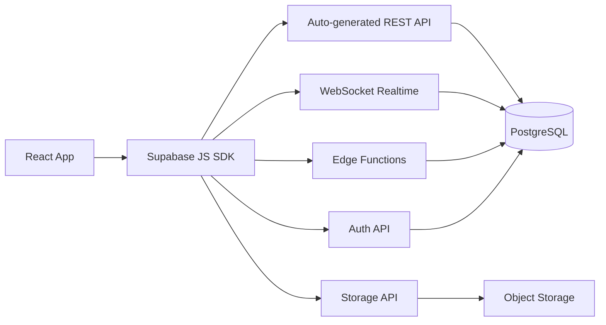

# API Reference

**Path**: `docs/06-api-reference.md`
**Last Updated**: February 14, 2026
**Related**: [Database Schema](05-database-schema.md) | [Technical Architecture](02-technical-architecture.md) | [Integrations](07-integrations.md)

---

## Table of Contents
- [Overview](#overview)
- [Supabase Client SDK](#supabase-client-sdk)
- [Database Tables API](#database-tables-api)
- [Edge Functions](#edge-functions)
- [RPC Functions](#rpc-functions)
- [Storage API](#storage-api)
- [Real-time Subscriptions](#real-time-subscriptions)
- [Authentication API](#authentication-api)
- [Error Handling](#error-handling)

---

## Overview

BD Mariner Hub uses **Supabase** as its backend platform, which auto-generates RESTful APIs for all database tables and provides Edge Functions for custom logic.

**API Base URL**: `https://[project-ref].supabase.co`

**Authentication**: JWT tokens via Supabase Auth

**Client Library**: `@supabase/supabase-js` v2.39.3

### API Architecture



---

## Supabase Client SDK

### Initialization

**File**: `src/supabaseClient.ts`

```typescript
import { createClient } from '@supabase/supabase-js';

const supabaseUrl = import.meta.env.VITE_SUPABASE_URL;
const supabaseAnonKey = import.meta.env.VITE_SUPABASE_ANON_KEY;

export const supabase = createClient(supabaseUrl, supabaseAnonKey);
```

**Environment Variables** (`.env`):
```bash
VITE_SUPABASE_URL=https://xxxxx.supabase.co
VITE_SUPABASE_ANON_KEY=eyJhbGciOiJIUzI1NiIsInR5cCI6IkpXVCJ9...
```

### TypeScript Support

```typescript
import { Database } from './database.types';

export const supabase = createClient<Database>(supabaseUrl, supabaseAnonKey);

// Now all queries are type-safe!
const { data } = await supabase
  .from('job_postings')  // ✅ TypeScript knows this table exists
  .select('rank, salary') // ✅ TypeScript validates these columns
  .eq('status', 'active'); // ✅ TypeScript checks 'active' is valid status
```

---

## Database Tables API

### Job Postings

#### Get All Active Jobs

```typescript
const { data, error } = await supabase
  .from('job_postings')
  .select('*')
  .in('status', ['approved', 'published', 'parsed'])
  .order('created_at', { ascending: false })
  .limit(50);

// Response:
// data: JobPosting[] | null
// error: PostgrestError | null
```

#### Get Job by ID

```typescript
const { data, error } = await supabase
  .from('job_postings')
  .select('*')
  .eq('id', jobId)
  .single();

// .single() returns object instead of array
```

#### Filter Jobs by Rank

```typescript
const { data, error } = await supabase
  .from('job_postings')
  .select('*')
  .ilike('rank', '%engineer%')  // Case-insensitive LIKE
  .eq('status', 'approved');
```

#### Filter Jobs by Salary Range

```typescript
const { data, error } = await supabase
  .from('job_postings')
  .select('*')
  .gte('parsed_content->salary', '8000')  // JSONB query
  .lte('parsed_content->salary', '10000');
```

#### Insert New Job (Admin Only)

```typescript
const { data, error } = await supabase
  .from('job_postings')
  .insert({
    source: 'manual',
    raw_content: jobText,
    status: 'pending'
  })
  .select()
  .single();
```

#### Update Job Status

```typescript
const { data, error } = await supabase
  .from('job_postings')
  .update({ status: 'approved' })
  .eq('id', jobId);
```

#### Delete Job

```typescript
const { error } = await supabase
  .from('job_postings')
  .delete()
  .eq('id', jobId);
```

---

### Profiles

#### Get Current User Profile

```typescript
const { data: { user } } = await supabase.auth.getUser();

const { data, error } = await supabase
  .from('profiles')
  .select('*')
  .eq('id', user.id)
  .single();
```

#### Update Profile

```typescript
const { data, error } = await supabase
  .from('profiles')
  .update({
    first_name: 'John',
    last_name: 'Doe',
    rank: 'Chief Engineer',
    cdc_number: 'BD123456'
  })
  .eq('id', user.id);
```

#### Add Sea Service Record

```typescript
const newRecord = {
  vessel_name: 'MV Pacific Star',
  vessel_type: 'Bulk Carrier',
  rank: 'Third Engineer',
  sign_on: '2025-01-15',
  sign_off: '2025-07-20',
  duration_days: 186
};

// Fetch current history
const { data: profile } = await supabase
  .from('profiles')
  .select('sea_service_history')
  .eq('id', user.id)
  .single();

// Append new record
const updatedHistory = [...(profile.sea_service_history || []), newRecord];

// Update profile
const { error } = await supabase
  .from('profiles')
  .update({ sea_service_history: updatedHistory })
  .eq('id', user.id);
```

#### Get Alumni by Academy

```typescript
const { data, error } = await supabase
  .from('profiles')
  .select('first_name, last_name, rank, academy, batch_year')
  .eq('academy', 'BMMTA')
  .eq('show_in_alumni', true)
  .order('batch_year', { ascending: false });
```

---

### Documents

#### Get User Documents

```typescript
const { data, error } = await supabase
  .from('documents')
  .select('*')
  .eq('user_id', user.id)
  .order('created_at', { ascending: false });
```

#### Upload Document

**Step 1: Upload file to Storage**
```typescript
const file = event.target.files[0];
const filePath = `${user.id}/${Date.now()}_${file.name}`;

const { data: uploadData, error: uploadError } = await supabase.storage
  .from('documents')
  .upload(filePath, file);
```

**Step 2: Insert document record**
```typescript
const { data, error } = await supabase
  .from('documents')
  .insert({
    user_id: user.id,
    title: 'CDC Certificate',
    category: 'License',
    document_number: 'BD123456',
    expiry_date: '2027-12-31',
    file_path: filePath
  })
  .select()
  .single();
```

#### Delete Document

```typescript
// Delete from database
const { error: dbError } = await supabase
  .from('documents')
  .delete()
  .eq('id', documentId);

// Delete file from storage
const { error: storageError } = await supabase.storage
  .from('documents')
  .remove([filePath]);
```

---

### Manning Agents

#### Get All Agencies

```typescript
const { data, error } = await supabase
  .from('manning_agents')
  .select('*')
  .order('company_name', { ascending: true });
```

#### Search Agencies

```typescript
const { data, error } = await supabase
  .from('manning_agents')
  .select('*')
  .or(`company_name.ilike.%${searchTerm}%,license_number.ilike.%${searchTerm}%`);
```

---

### Medical Centers

#### Get Centers by City

```typescript
const { data, error } = await supabase
  .from('medical_centers')
  .select('*')
  .eq('city', 'Chittagong')
  .eq('dg_approved', true);
```

---

### Forum Posts

#### Get Recent Posts

```typescript
const { data, error } = await supabase
  .from('forum_posts')
  .select(`
    *,
    author:profiles(first_name, last_name, rank)
  `)
  .is('parent_post_id', null)  // Top-level posts only
  .order('created_at', { ascending: false })
  .limit(20);
```

#### Create Post

```typescript
const { data, error } = await supabase
  .from('forum_posts')
  .insert({
    author_id: user.id,
    title: 'Interview Tips for Chief Engineer Position',
    content: 'Here are some tips...',
    category: 'Interview'
  })
  .select()
  .single();
```

#### Add Reply

```typescript
const { data, error } = await supabase
  .from('forum_posts')
  .insert({
    author_id: user.id,
    parent_post_id: originalPostId,
    content: 'Great advice! I also recommend...'
  });
```

#### Upvote Post

```typescript
const { data, error } = await supabase.rpc('increment_upvotes', {
  post_id: postId
});
```

---

### Chat Messages

#### Get User Chat History

```typescript
const { data, error } = await supabase
  .from('chat_messages')
  .select('*')
  .eq('user_id', user.id)
  .order('created_at', { ascending: true })
  .limit(50);
```

#### Save Chat Message

```typescript
const { data, error } = await supabase
  .from('chat_messages')
  .insert({
    user_id: user.id,
    role: 'user',  // or 'assistant'
    content: 'What certifications do I need for Chief Engineer?',
    tokens_used: 15
  });
```

---

## Edge Functions

Edge Functions are serverless TypeScript functions running on Deno.

**Base URL**: `https://[project-ref].supabase.co/functions/v1/`

### 1. telegram-webhook

**Endpoint**: `POST /functions/v1/telegram-webhook`

**Purpose**: Receives Telegram bot updates and processes job postings

**Authentication**: Webhook secret token

**Request**:
```json
{
  "update_id": 123456789,
  "message": {
    "message_id": 987,
    "chat": {
      "id": -100123456,
      "title": "Maritime Jobs BD"
    },
    "text": "RANK: Chief Engineer\nSALARY: $8500..."
  }
}
```

**Response**:
```json
{
  "success": true,
  "message": "Job posting processed successfully",
  "job_id": "550e8400-e29b-41d4-a716-446655440000"
}
```

**Error Response**:
```json
{
  "success": false,
  "error": "Duplicate message detected"
}
```

**Headers**:
```
X-Telegram-Bot-Api-Secret-Token: your_webhook_secret
```

---

### 2. job-parser

**Endpoint**: `POST /functions/v1/job-parser`

**Purpose**: Parse job text using Gemini AI

**Authentication**: Service role key or anon key

**Request**:
```json
{
  "raw_content": "RANK: Master\nSALARY: $9500\nJOINING: Urgent...",
  "job_id": "uuid-optional"
}
```

**Response**:
```json
{
  "success": true,
  "data": {
    "rank": "Master",
    "salary": "$9500",
    "joining_date": "Urgent",
    "agency": "SeaWays Ltd",
    "mla_number": "MLA-12345",
    "address": "45 Marine Drive, Mumbai",
    "mobile": "+91-9876543210",
    "email": "recruit@seaways.com"
  }
}
```

**Usage**:
```typescript
const { data, error } = await supabase.functions.invoke('job-parser', {
  body: { raw_content: jobText }
});
```

---

### 3. cdc-verify

**Endpoint**: `POST /functions/v1/cdc-verify`

**Purpose**: Verify CDC number against authorized doctors list

**Request**:
```json
{
  "cdc_number": "BD123456"
}
```

**Response**:
```json
{
  "valid": true,
  "doctor_name": "Dr. Ahmed Khan",
  "medical_center": "Dhaka Medical Center"
}
```

---

## RPC Functions

Remote Procedure Calls (RPCs) are custom SQL functions exposed via REST API.

### 1. increment_usage_minutes

**Purpose**: Track AI chat usage

**SQL Definition**:
```sql
CREATE FUNCTION increment_usage_minutes(x int, user_id uuid)
RETURNS void AS $$
BEGIN
  UPDATE profiles
  SET total_usage_minutes = COALESCE(total_usage_minutes, 0) + x
  WHERE id = user_id;
END;
$$ LANGUAGE plpgsql SECURITY DEFINER;
```

**Usage**:
```typescript
const { error } = await supabase.rpc('increment_usage_minutes', {
  x: 5,
  user_id: user.id
});
```

---

### 2. increment_parsing_attempts

**Purpose**: Atomically increment job parsing attempts

**Usage**:
```typescript
const { data, error } = await supabase.rpc('increment_parsing_attempts', {
  job_uuid: jobId
});

// Returns: new attempt count (e.g., 2)
```

---

### 3. auto_expire_old_jobs

**Purpose**: Mark jobs older than 60 days as expired

**Usage**:
```typescript
const { data, error } = await supabase.rpc('auto_expire_old_jobs');

// Returns: number of jobs expired (e.g., 15)
```

---

### 4. refresh_active_jobs

**Purpose**: Refresh materialized view

**Usage**:
```typescript
const { error } = await supabase.rpc('refresh_active_jobs');
```

---

## Storage API

### Buckets

- **avatars**: User profile pictures (public)
- **documents**: Seafarer documents (private)

### Upload File

```typescript
const file = event.target.files[0];
const filePath = `${user.id}/${file.name}`;

const { data, error } = await supabase.storage
  .from('documents')
  .upload(filePath, file, {
    cacheControl: '3600',
    upsert: false  // Fail if file exists
  });
```

### Download File

```typescript
const { data, error } = await supabase.storage
  .from('documents')
  .download(filePath);

// Convert to URL
const url = URL.createObjectURL(data);
```

### Get Public URL

```typescript
const { data } = supabase.storage
  .from('avatars')
  .getPublicUrl(filePath);

// data.publicUrl: "https://xxx.supabase.co/storage/v1/object/public/avatars/..."
```

### Delete File

```typescript
const { error } = await supabase.storage
  .from('documents')
  .remove([filePath]);
```

### List Files

```typescript
const { data, error } = await supabase.storage
  .from('documents')
  .list(user.id, {
    limit: 100,
    offset: 0,
    sortBy: { column: 'created_at', order: 'desc' }
  });
```

---

## Real-time Subscriptions

### Subscribe to New Jobs

```typescript
const channel = supabase
  .channel('job-updates')
  .on(
    'postgres_changes',
    {
      event: 'INSERT',
      schema: 'public',
      table: 'job_postings',
      filter: 'status=eq.approved'
    },
    (payload) => {
      console.log('New job posted:', payload.new);
      // Update UI with new job
    }
  )
  .subscribe();

// Cleanup
channel.unsubscribe();
```

### Subscribe to Profile Changes

```typescript
const channel = supabase
  .channel(`profile-${user.id}`)
  .on(
    'postgres_changes',
    {
      event: 'UPDATE',
      schema: 'public',
      table: 'profiles',
      filter: `id=eq.${user.id}`
    },
    (payload) => {
      console.log('Profile updated:', payload.new);
    }
  )
  .subscribe();
```

### Subscribe to Forum Activity

```typescript
const channel = supabase
  .channel('forum-updates')
  .on(
    'postgres_changes',
    {
      event: '*',  // All events (INSERT, UPDATE, DELETE)
      schema: 'public',
      table: 'forum_posts'
    },
    (payload) => {
      if (payload.eventType === 'INSERT') {
        // New post
      } else if (payload.eventType === 'UPDATE') {
        // Post edited
      }
    }
  )
  .subscribe();
```

---

## Authentication API

### Sign Up

```typescript
const { data, error } = await supabase.auth.signUp({
  email: 'seafarer@example.com',
  password: 'secure_password',
  options: {
    data: {
      first_name: 'John',
      last_name: 'Doe'
    }
  }
});
```

### Sign In

```typescript
const { data, error } = await supabase.auth.signInWithPassword({
  email: 'seafarer@example.com',
  password: 'secure_password'
});

// data.user: User object
// data.session: Session with JWT token
```

### Sign Out

```typescript
const { error } = await supabase.auth.signOut();
```

### Get Current User

```typescript
const { data: { user } } = await supabase.auth.getUser();

if (user) {
  console.log('Logged in as:', user.email);
} else {
  console.log('Not logged in');
}
```

### Get Session

```typescript
const { data: { session } } = await supabase.auth.getSession();

if (session) {
  console.log('Access token:', session.access_token);
}
```

### Listen to Auth Changes

```typescript
supabase.auth.onAuthStateChange((event, session) => {
  if (event === 'SIGNED_IN') {
    console.log('User signed in:', session.user);
  } else if (event === 'SIGNED_OUT') {
    console.log('User signed out');
  }
});
```

### Reset Password

```typescript
// Send reset email
const { error } = await supabase.auth.resetPasswordForEmail(
  'seafarer@example.com',
  { redirectTo: 'https://bdmarinerhub.com/reset-password' }
);

// Update password (after email link clicked)
const { error } = await supabase.auth.updateUser({
  password: 'new_secure_password'
});
```

---

## Error Handling

### PostgrestError

```typescript
const { data, error } = await supabase
  .from('job_postings')
  .select('*')
  .eq('id', 'invalid-uuid');

if (error) {
  console.error('Database error:', error.message);
  // error.code: '22P02' (invalid UUID)
  // error.details: Additional error details
  // error.hint: Suggestion to fix the error
}
```

### Common Error Codes

| Code | Message | Cause |
|------|---------|-------|
| `22P02` | Invalid input syntax for UUID | Invalid UUID format |
| `23505` | Duplicate key value | Unique constraint violation |
| `23503` | Foreign key violation | Referenced record doesn't exist |
| `42501` | Permission denied | RLS policy blocked access |
| `PGRST116` | No rows found | `.single()` returned 0 rows |

### Error Handling Pattern

```typescript
async function fetchJobs() {
  try {
    const { data, error } = await supabase
      .from('job_postings')
      .select('*');

    if (error) throw error;

    return data;
  } catch (error) {
    console.error('Error fetching jobs:', error);
    // Show user-friendly error message
    alert('Failed to load jobs. Please try again.');
    return [];
  }
}
```

### Edge Function Errors

```typescript
const { data, error } = await supabase.functions.invoke('job-parser', {
  body: { raw_content: jobText }
});

if (error) {
  // error.message: Error message
  // error.context: Additional context
  console.error('Function error:', error);
}
```

---

## Rate Limiting

**Supabase Free Tier Limits**:
- Database queries: Unlimited
- Edge Function calls: 500K/month
- Storage downloads: 2GB/month
- Real-time connections: 200 concurrent

**Best Practices**:
- Implement client-side caching
- Use pagination for large datasets
- Debounce search queries
- Use materialized views for expensive queries

---

## Performance Tips

### 1. Select Only Needed Columns

```typescript
// ❌ Bad: Fetches all columns
const { data } = await supabase.from('job_postings').select('*');

// ✅ Good: Fetches only needed columns
const { data } = await supabase
  .from('job_postings')
  .select('id, rank, salary, agency');
```

### 2. Use Pagination

```typescript
const page = 1;
const itemsPerPage = 20;

const { data, error } = await supabase
  .from('job_postings')
  .select('*')
  .range(page * itemsPerPage, (page + 1) * itemsPerPage - 1);
```

### 3. Use Materialized Views

```typescript
// ✅ Fast: Query pre-computed view
const { data } = await supabase.from('active_jobs').select('*');

// ❌ Slow: Query with complex filters
const { data } = await supabase
  .from('job_postings')
  .select('*')
  .in('status', ['approved', 'published'])
  .gte('created_at', thirtyDaysAgo);
```

### 4. Batch Operations

```typescript
// ✅ Good: Insert multiple rows at once
const { data, error } = await supabase
  .from('chat_messages')
  .insert([message1, message2, message3]);

// ❌ Bad: Multiple individual inserts
await supabase.from('chat_messages').insert(message1);
await supabase.from('chat_messages').insert(message2);
await supabase.from('chat_messages').insert(message3);
```

---

## Related Documentation
- **[Database Schema](05-database-schema.md)** - Complete schema reference
- **[Integrations](07-integrations.md)** - External API integrations
- **[Technical Architecture](02-technical-architecture.md)** - System architecture
- **[Deployment Guide](../DEPLOYMENT_GUIDE.md)** - Edge Function deployment

---

**Next**: [Integrations](07-integrations.md)
