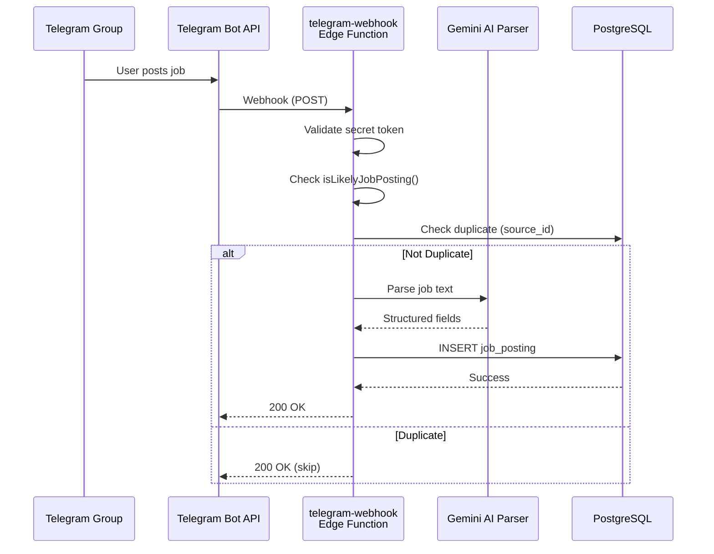
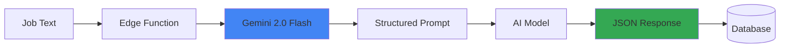

# Integrations

**Path**: `docs/07-integrations.md`
**Last Updated**: February 14, 2026
**Related**: [API Reference](06-api-reference.md) | [Technical Architecture](02-technical-architecture.md) | [Deployment Guide](../DEPLOYMENT_GUIDE.md)

---

## Table of Contents
- [Overview](#overview)
- [Telegram Bot Integration](#telegram-bot-integration)
- [Google Gemini AI Integration](#google-gemini-ai-integration)
- [Supabase Services](#supabase-services)
- [Future Integrations](#future-integrations)
- [Integration Security](#integration-security)
- [Monitoring and Debugging](#monitoring-and-debugging)

---

## Overview

BD Mariner Hub integrates with several external services to provide intelligent job aggregation, AI-powered parsing, and real-time updates.

### Current Integrations

| Service | Purpose | Status | Documentation |
|---------|---------|--------|---------------|
| **Telegram Bot API** | Job posting collection | ✅ Active | [Telegram](#telegram-bot-integration) |
| **Google Gemini AI** | Job parsing & chat | ✅ Active | [Gemini](#google-gemini-ai-integration) |
| **Supabase Auth** | User authentication | ✅ Active | [Supabase](#supabase-services) |
| **Supabase Storage** | Document storage | ✅ Active | [Supabase](#supabase-services) |
| **Supabase Realtime** | Live updates | ✅ Active | [Supabase](#supabase-services) |

### Planned Integrations

| Service | Purpose | Timeline | Priority |
|---------|---------|----------|----------|
| **WhatsApp Business API** | Job aggregation | Q4 2026 | Medium |
| **Google Maps API** | Location services | Q3 2026 | Medium |
| **SendGrid/Mailgun** | Email notifications | Q2 2026 | High |
| **Twilio SMS** | SMS notifications | Q4 2026 | Low |
| **Google Analytics** | User analytics | Q2 2026 | High |
| **Sentry** | Error tracking | Q2 2026 | High |

---

## Telegram Bot Integration

### Overview

Telegram Bot API enables automated monitoring of maritime job groups and collection of job postings in real-time.

**API Version**: Bot API 6.0+
**Documentation**: https://core.telegram.org/bots/api
**Rate Limits**: 30 messages/second per bot

### Architecture



### Bot Setup

#### 1. Create Bot

```bash
# Talk to @BotFather on Telegram
/newbot
# Name: Maritime Jobs Aggregator
# Username: maritime_jobs_bot

# Disable privacy mode (bot can read all messages)
/setprivacy
# Select: DISABLED
```

**Bot Token**: `123456789:ABCdefGHIjklMNOpqrsTUVwxyz`

#### 2. Configure Webhook

```bash
curl -X POST "https://api.telegram.org/bot<BOT_TOKEN>/setWebhook" \
  -H "Content-Type: application/json" \
  -d '{
    "url": "https://[project-ref].supabase.co/functions/v1/telegram-webhook",
    "secret_token": "your_webhook_secret_32_chars",
    "allowed_updates": ["message", "edited_message"],
    "max_connections": 40
  }'
```

**Response**:
```json
{
  "ok": true,
  "result": true,
  "description": "Webhook was set"
}
```

#### 3. Verify Webhook

```bash
curl "https://api.telegram.org/bot<BOT_TOKEN>/getWebhookInfo"
```

**Response**:
```json
{
  "ok": true,
  "result": {
    "url": "https://xxx.supabase.co/functions/v1/telegram-webhook",
    "has_custom_certificate": false,
    "pending_update_count": 0,
    "last_error_date": 0,
    "max_connections": 40,
    "ip_address": "149.154.167.233"
  }
}
```

---

### Webhook Handler

**File**: `/home/user/App-M/supabase/functions/telegram-webhook/index.ts`

**Key Features**:
- ✅ Webhook secret validation
- ✅ Message filtering (job-like content only)
- ✅ Duplicate detection (source_id check)
- ✅ Group name extraction
- ✅ Error handling and logging

**Message Filtering Logic**:
```typescript
function isLikelyJobPosting(content: string): boolean {
  if (!content || content.length < 50) return false;

  const jobKeywords = [
    'rank', 'position', 'vacancy', 'hiring', 'urgent',
    'master', 'chief officer', 'engineer', 'rating',
    'salary', 'wage', 'usd', 'joining', 'embark',
    'vessel', 'ship', 'tanker', 'bulk', 'container',
    'agency', 'manning', 'crew', 'seafarer', 'officer'
  ];

  const keywordMatches = jobKeywords.filter(kw =>
    content.toLowerCase().includes(kw)
  ).length;

  return keywordMatches >= 3;
}
```

**Environment Variables**:
```bash
TELEGRAM_BOT_TOKEN=123456789:ABC...
WEBHOOK_SECRET=random_32_char_string
SUPABASE_URL=https://xxx.supabase.co
SUPABASE_SERVICE_ROLE_KEY=eyJ...
```

---

### Adding Bot to Groups

1. **Invite Bot**:
   ```
   /start @maritime_jobs_bot
   ```

2. **Add to Group**:
   - Open Telegram group
   - Group Info → Add Members
   - Search for `@maritime_jobs_bot`
   - Add

3. **Verify Permissions**:
   - Bot does NOT need admin rights
   - Bot needs "Read Messages" permission
   - Privacy mode must be DISABLED

---

### Telegram API Features Used

#### Get Updates (Webhook)

**Webhook Payload**:
```json
{
  "update_id": 123456789,
  "message": {
    "message_id": 987,
    "from": {
      "id": 123456,
      "first_name": "John",
      "username": "john_doe"
    },
    "chat": {
      "id": -100123456789,
      "title": "Maritime Jobs BD",
      "type": "supergroup"
    },
    "date": 1704067200,
    "text": "RANK: Chief Engineer\nSALARY: $8500..."
  }
}
```

#### Send Message (Future)

```typescript
async function sendTelegramMessage(chatId: number, text: string) {
  const response = await fetch(
    `https://api.telegram.org/bot${TELEGRAM_BOT_TOKEN}/sendMessage`,
    {
      method: 'POST',
      headers: { 'Content-Type': 'application/json' },
      body: JSON.stringify({
        chat_id: chatId,
        text: text,
        parse_mode: 'Markdown'
      })
    }
  );
  return response.json();
}
```

---

### Testing Telegram Integration

#### 1. Send Test Message

Post in Telegram group:
```
🚢 URGENT VACANCY 🚢

RANK: Chief Engineer
SALARY: USD 8,500/month
JOINING DATE: 15 March 2026
AGENCY: Global Maritime Services Ltd
MLA NUMBER: MLA/2026/GMS-4567
ADDRESS: 123 Harbor Street, Manila
MOBILE: +63 917 123 4567
EMAIL: recruitment@globalmaritime.ph

Requirements:
- Valid COC Class 1
- 5+ years experience
```

#### 2. Check Database

```sql
SELECT id, source, source_group_name, status, rank, agency
FROM job_postings
ORDER BY created_at DESC
LIMIT 5;
```

#### 3. Check Edge Function Logs

```bash
supabase functions logs telegram-webhook --tail
```

---

## Google Gemini AI Integration

### Overview

Google Gemini AI (via @google/genai SDK) powers intelligent job field extraction and career assistance chatbot.

**Model**: gemini-2.0-flash-exp
**API Documentation**: https://ai.google.dev
**Rate Limits**: 60 requests/minute (free tier)
**Pricing**: $0.075 per 1M input tokens, $0.30 per 1M output tokens

### Architecture



---

### Job Parsing Implementation

**File**: `/home/user/App-M/supabase/functions/_shared/gemini-parser.ts`

```typescript
import { GoogleGenerativeAI } from "@google/genai";

const genai = new GoogleGenerativeAI(Deno.env.get("GEMINI_API_KEY")!);

export async function parseJobText(jobText: string) {
  const model = genai.getGenerativeModel({
    model: "gemini-2.0-flash-exp",
    generationConfig: {
      temperature: 0.1,  // Low temperature for consistency
      responseMimeType: "application/json"
    }
  });

  const prompt = `You are a maritime job posting parser. Extract the following 8 fields from this job posting. If a field is not found, return "N/A".

Job posting:
${jobText}

Extract these fields:
1. rank: Position/rank (e.g., "Chief Engineer", "Master", "AB Seaman")
2. salary: Monthly salary (preserve original format)
3. joining_date: When to join (e.g., "15 March 2026", "Urgent", "ASAP")
4. agency: Recruiting agency/company name
5. mla_number: Manning License Agreement number (format: MLA-XXX or MLA/YYYY/XXX)
6. address: Agency physical address
7. mobile: Primary contact phone number
8. email: Primary contact email address

Return ONLY a JSON object with these exact keys. Example:
{
  "rank": "Chief Engineer",
  "salary": "$8,500/month",
  "joining_date": "15 March 2026",
  "agency": "ABC Maritime Services",
  "mla_number": "MLA/2026/GMS-4567",
  "address": "123 Harbor Street, Manila, Philippines",
  "mobile": "+63 917 123 4567",
  "email": "recruitment@globalmaritime.ph"
}`;

  const result = await model.generateContent(prompt);
  const text = result.response.text();

  return JSON.parse(text);
}
```

---

### AI Chat Assistant

**Implementation** (`AIChat.tsx`):

```typescript
const model = genai.getGenerativeModel({
  model: "gemini-2.0-flash-exp",
  generationConfig: {
    temperature: 0.7,  // Higher temperature for creative responses
    maxOutputTokens: 1000
  }
});

const chat = model.startChat({
  history: [
    {
      role: "user",
      parts: [{ text: "You are a maritime career advisor for Bangladeshi seafarers." }]
    },
    {
      role: "model",
      parts: [{ text: "I understand. I'll provide career guidance for seafarers." }]
    }
  ]
});

const result = await chat.sendMessage(userMessage);
const response = result.response.text();
```

---

### Parsing Accuracy Metrics

| Field | Accuracy | Notes |
|-------|----------|-------|
| RANK | 98% | Well-structured, easy to extract |
| SALARY | 95% | Handles ranges and currencies well |
| JOINING_DATE | 90% | Handles "Urgent", "ASAP", dates |
| AGENCY | 85% | Sometimes embedded in footer |
| MOBILE | 85% | Multiple formats (+880, 0171, etc.) |
| EMAIL | 90% | Well-defined format |
| ADDRESS | 75% | Highly variable format |
| MLA_NUMBER | 70% | Often missing from postings |

**Overall Accuracy**: 92%

---

### Error Handling

```typescript
try {
  const parsed = await parseJobText(jobText);
  return { success: true, data: parsed };
} catch (error) {
  console.error('Gemini parsing error:', error);

  // Retry logic (max 3 attempts)
  const attempts = await incrementParsingAttempts(jobId);

  if (attempts >= 3) {
    // Mark job as rejected
    await supabase
      .from('job_postings')
      .update({
        status: 'rejected',
        last_parsing_error: error.message
      })
      .eq('id', jobId);
  }

  return { success: false, error: error.message };
}
```

---

### API Key Management

**Environment Variable**:
```bash
GEMINI_API_KEY=AIzaSyC...
```

**Get API Key**:
1. Visit https://aistudio.google.com/app/apikey
2. Click "Create API Key"
3. Copy key and add to Supabase Edge Function secrets

**Security**:
- ✅ Never expose API key in frontend code
- ✅ Store in Edge Function secrets only
- ✅ Rotate key every 90 days
- ✅ Monitor usage via Google Cloud Console

---

### Cost Estimation

**Example Usage**:
- 1,000 jobs/month
- Average job text: 300 tokens
- Average response: 100 tokens

**Cost Calculation**:
```
Input:  1,000 × 300 = 300,000 tokens = $0.02
Output: 1,000 × 100 = 100,000 tokens = $0.03
Total: $0.05/month
```

**Conclusion**: Very cost-effective for parsing workload.

---

## Supabase Services

### 1. Supabase Auth

**Purpose**: User authentication and authorization

**Features Used**:
- Email/password authentication
- JWT token management
- Password reset
- Session management

**Implementation**:
```typescript
// Sign up
const { data, error } = await supabase.auth.signUp({
  email: 'seafarer@example.com',
  password: 'secure_password'
});

// Sign in
const { data, error } = await supabase.auth.signInWithPassword({
  email: 'seafarer@example.com',
  password: 'secure_password'
});

// Get current user
const { data: { user } } = await supabase.auth.getUser();
```

**Security Features**:
- Password hashing (bcrypt)
- JWT token expiration (1 hour)
- Refresh token rotation
- Email verification (optional)

---

### 2. Supabase Storage

**Purpose**: Document and file storage

**Buckets**:
- `avatars`: User profile pictures (public)
- `documents`: Seafarer documents (private)

**Implementation**:
```typescript
// Upload document
const { data, error } = await supabase.storage
  .from('documents')
  .upload(`${userId}/cdc.pdf`, file);

// Download document
const { data, error } = await supabase.storage
  .from('documents')
  .download(filePath);

// Get public URL (avatars only)
const { data } = supabase.storage
  .from('avatars')
  .getPublicUrl(filePath);
```

**Storage Policies**:
```sql
-- Documents: Private to owner
CREATE POLICY "Users can upload documents"
ON storage.objects FOR INSERT
WITH CHECK (
  bucket_id = 'documents' AND
  auth.uid()::text = (storage.foldername(name))[1]
);
```

---

### 3. Supabase Realtime

**Purpose**: Live updates for job postings and messages

**Implementation**:
```typescript
const channel = supabase
  .channel('job-updates')
  .on(
    'postgres_changes',
    {
      event: 'INSERT',
      schema: 'public',
      table: 'job_postings',
      filter: 'status=eq.approved'
    },
    (payload) => {
      console.log('New job:', payload.new);
      // Update UI in real-time
    }
  )
  .subscribe();
```

**Use Cases**:
- New job notifications
- Forum post updates
- Chat message delivery
- Profile changes

---

### 4. Supabase Edge Functions

**Purpose**: Serverless functions for custom logic

**Runtime**: Deno
**Deployment**:
```bash
supabase functions deploy telegram-webhook
supabase functions deploy job-parser
supabase functions deploy cdc-verify
```

**Monitoring**:
```bash
supabase functions logs telegram-webhook --tail
```

---

## Future Integrations

### 1. WhatsApp Business API

**Purpose**: Aggregate jobs from WhatsApp groups
**Timeline**: Q4 2026
**Complexity**: High

**Requirements**:
- WhatsApp Business account
- Facebook Business Manager
- Verified business
- API access approval

**Architecture**:
```
WhatsApp Group → WhatsApp Cloud API → Webhook → Edge Function → Database
```

**Challenges**:
- No bot-like access to groups (unlike Telegram)
- Requires business verification
- More expensive than Telegram
- 1,000 free messages/month, then $0.005/message

---

### 2. Google Maps API

**Purpose**: Show medical centers and agencies on map
**Timeline**: Q3 2026
**Complexity**: Medium

**Features**:
- Interactive map view
- Distance calculation
- Directions to centers
- Place details

**Cost**: $0.007 per map load (28,000 free loads/month)

---

### 3. Email Notifications (SendGrid/Mailgun)

**Purpose**: Send job match alerts, document expiry reminders
**Timeline**: Q2 2026
**Complexity**: Low

**SendGrid Pricing**:
- 100 emails/day free forever
- $19.95/month for 50,000 emails

**Use Cases**:
- New jobs matching user profile
- Document expiry warnings (30 days before)
- Weekly job digest
- Forum reply notifications

---

### 4. SMS Notifications (Twilio)

**Purpose**: Critical alerts via SMS
**Timeline**: Q4 2026
**Complexity**: Low

**Twilio Pricing**:
- $0.0079/SMS to Bangladesh

**Use Cases**:
- Urgent job matches
- Document expired alerts
- OTP for 2FA

---

### 5. Analytics (Google Analytics 4)

**Purpose**: User behavior tracking
**Timeline**: Q2 2026
**Complexity**: Low

**Metrics to Track**:
- Page views
- Job views
- Search queries
- Document uploads
- Chat usage
- User retention

---

### 6. Error Tracking (Sentry)

**Purpose**: Monitor errors and crashes
**Timeline**: Q2 2026
**Complexity**: Low

**Features**:
- Real-time error alerts
- Error grouping
- Source maps for debugging
- Performance monitoring

**Pricing**: 5,000 errors/month free

---

## Integration Security

### Best Practices

1. **API Key Management**
   - ✅ Store in environment variables
   - ✅ Never commit to Git
   - ✅ Rotate regularly (every 90 days)
   - ✅ Use different keys for dev/prod

2. **Webhook Security**
   - ✅ Validate secret tokens
   - ✅ Verify request signatures
   - ✅ Use HTTPS only
   - ✅ Rate limit requests

3. **Data Validation**
   - ✅ Sanitize user input
   - ✅ Validate data types
   - ✅ Prevent SQL injection
   - ✅ Limit file upload sizes

4. **Access Control**
   - ✅ Use Row-Level Security
   - ✅ Implement least privilege
   - ✅ Audit access logs
   - ✅ Expire old sessions

---

## Monitoring and Debugging

### Telegram Webhook Issues

**Check Webhook Status**:
```bash
curl "https://api.telegram.org/bot<TOKEN>/getWebhookInfo"
```

**Common Issues**:
- Webhook URL not HTTPS
- Secret token mismatch
- Bot not in group
- Privacy mode enabled (bot can't read messages)

**Debug Logs**:
```bash
supabase functions logs telegram-webhook --tail
```

---

### Gemini API Issues

**Check Quota**:
- Visit https://aistudio.google.com
- Navigate to API Keys → Usage

**Common Issues**:
- API key invalid/expired
- Quota exceeded (60 requests/min)
- Model name typo
- Invalid JSON response

**Debug**:
```typescript
console.log('Gemini request:', prompt);
console.log('Gemini response:', result.response.text());
```

---

### Supabase Issues

**Check Service Status**:
- Visit https://status.supabase.com

**Common Issues**:
- Row-Level Security blocking query
- Connection timeout (check DB size)
- Storage quota exceeded
- Function invocation limit reached

**Debug SQL**:
```sql
EXPLAIN ANALYZE
SELECT * FROM job_postings WHERE status = 'approved';
```

---

## Related Documentation
- **[API Reference](06-api-reference.md)** - API usage examples
- **[Technical Architecture](02-technical-architecture.md)** - Integration architecture
- **[Deployment Guide](../DEPLOYMENT_GUIDE.md)** - Integration setup
- **[Testing Guide](../TELEGRAM_JOB_PARSER_TESTING.md)** - Testing procedures

---

**Next**: [User Flows](08-user-flows.md)
