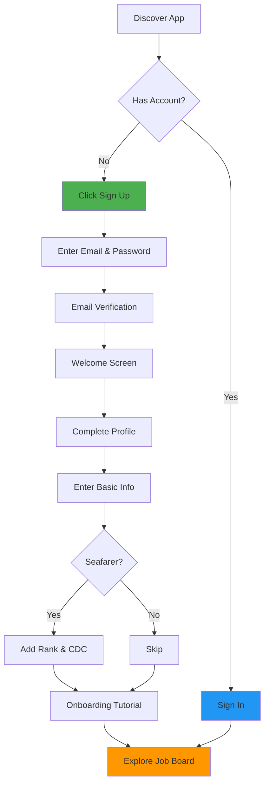
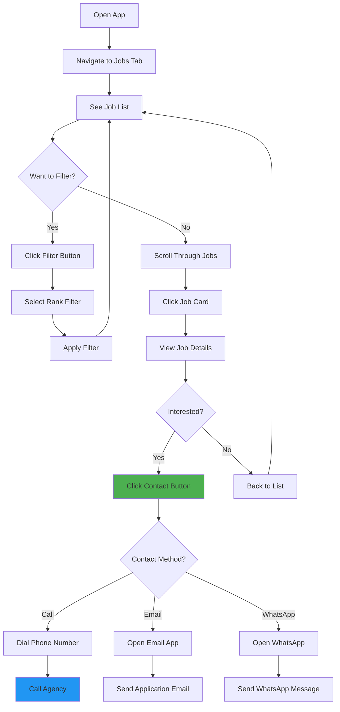
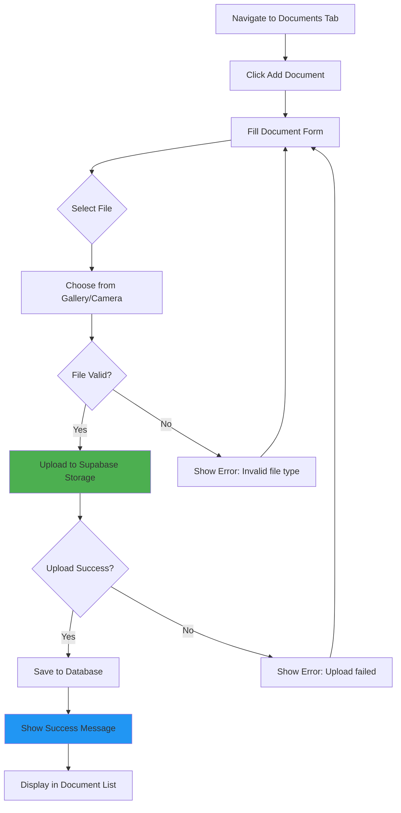
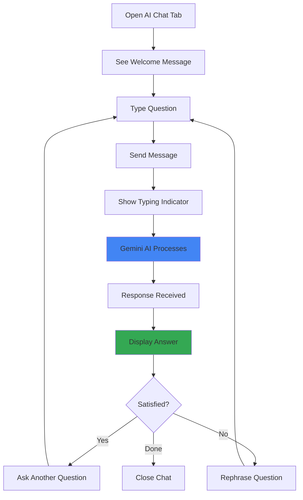
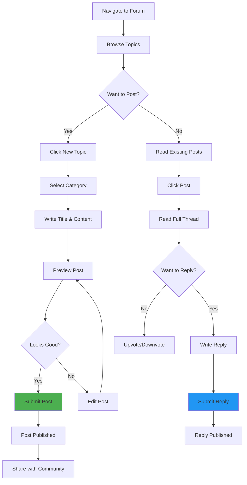
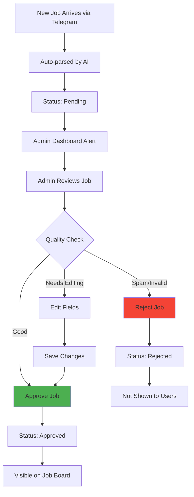

# User Flows

**Path**: `docs/08-user-flows.md`
**Last Updated**: February 14, 2026
**Related**: [Product Vision](01-product-vision.md) | [Features](03-features.md) | [Marketing & SEO](09-marketing-seo.md)

---

## Table of Contents
- [Overview](#overview)
- [New User Onboarding](#new-user-onboarding)
- [Job Discovery Flow](#job-discovery-flow)
- [Job Application Flow](#job-application-flow)
- [Document Management Flow](#document-management-flow)
- [AI Career Assistant Flow](#ai-career-assistant-flow)
- [Community Engagement Flow](#community-engagement-flow)
- [Admin Workflows](#admin-workflows)
- [Error States and Edge Cases](#error-states-and-edge-cases)

---

## Overview

This document maps out the complete user journeys through BD Mariner Hub, from initial discovery to active engagement.

### User Personas

**Primary Persona: Active Job Seeker**
- Name: Kamal Rahman
- Age: 28
- Current Rank: Third Engineer
- Goal: Find Chief Engineer position
- Tech Proficiency: Moderate (uses WhatsApp, Facebook daily)

**Secondary Persona: Onboard Seafarer**
- Name: Rashed Ahmed
- Age: 35
- Current Rank: Chief Officer
- Goal: Track documents, plan next contract
- Tech Proficiency: Low (occasional smartphone use)

**Tertiary Persona: Maritime Academy Student**
- Name: Nusrat Jahan
- Age: 22
- Status: Final year cadet
- Goal: Find first job, connect with alumni
- Tech Proficiency: High (digital native)

---

## New User Onboarding

### Flow Diagram



---

### Step-by-Step: First-Time User

#### 1. Discovery
**Touchpoints**:
- Facebook maritime groups
- Word-of-mouth from fellow seafarers
- Google search "maritime jobs Bangladesh"

**Landing Page**:
- Clear value proposition: "Find All Maritime Jobs in One Place"
- Screenshot of job board
- Testimonials (future)
- CTA: "Get Started Free"

---

#### 2. Sign Up

**Form Fields**:
```
Email: [                    ]
Password: [                 ]
Confirm Password: [         ]

[ ] I agree to Terms & Conditions

[Create Account] [Sign in instead]
```

**Validation**:
- Email format check
- Password strength (min 8 chars)
- Password match confirmation

**Success**:
- Auto-create profile in database
- Show "Account created successfully"
- Redirect to profile completion

---

#### 3. Profile Completion

**Optional Fields** (can skip and complete later):
```
First Name: [         ]
Last Name: [          ]
Department: [Deck ▼  ] (Dropdown: Deck, Engine, Galley, Other)
Current Rank: [       ]
CDC Number: [         ]
Mobile: [+880         ]
Date of Birth: [📅    ]
```

**CTA**:
- "Save & Continue" (green button)
- "Skip for now" (gray link)

---

#### 4. Onboarding Tutorial (3 screens)

**Screen 1: Job Board**
```
🚢 Find Your Next Opportunity

Browse 100+ maritime jobs updated daily
from verified agencies across Bangladesh.

[Next →]
```

**Screen 2: AI Assistant**
```
🤖 Get Career Guidance

Ask our AI assistant about certificates,
salaries, and career progression.

[Next →]
```

**Screen 3: Documents**
```
📄 Manage Your Credentials

Upload and track all your seafarer
documents in one secure place.

[Get Started 🎉]
```

---

#### 5. First Session Goals

**Immediate Actions**:
1. View at least 5 job postings
2. Save 1 job to favorites (future feature)
3. Ask 1 question to AI chat
4. Upload 1 document (encouraged, not required)

**Success Metrics**:
- Time to first job view: <30 seconds
- Profile completion rate: >60%
- Tutorial completion: >70%
- Return next day: >40%

---

## Job Discovery Flow

### Primary Flow: Browse Jobs



---

### Job List View

**UI Components**:
```
┌─────────────────────────────────────┐
│ 🔍 Search jobs...                   │
│ [Filter ▼]         [Sort: Newest ▼]│
├─────────────────────────────────────┤
│ ┌─────────────────────────────────┐ │
│ │ 🚢 Chief Engineer                │ │
│ │ ABC Maritime Services            │ │
│ │ 💰 $8,500/month | 📅 15 Mar 2026│ │
│ │ [Active]  MLA-002  [View →]     │ │
│ └─────────────────────────────────┘ │
│                                     │
│ ┌─────────────────────────────────┐ │
│ │ 🚢 Master                        │ │
│ │ Global Shipping Ltd              │ │
│ │ 💰 $12,000/month | 📅 Urgent    │ │
│ │ [Active]  MLA-008  [View →]     │ │
│ └─────────────────────────────────┘ │
└─────────────────────────────────────┘
```

**Sorting Options**:
- Newest first (default)
- Highest salary
- Joining soonest

**Filter Options**:
- Rank (dropdown multi-select)
- Salary range (slider)
- Joining date range
- Agency name

---

### Job Detail View

**Layout**:
```
┌───────────────────────────────────────┐
│ ← Back                                │
├───────────────────────────────────────┤
│ 🚢 Chief Engineer                     │
│ ABC Maritime Services                 │
│                                       │
│ 💰 Salary: $8,500/month               │
│ 📅 Joining: 15 March 2026             │
│ 🏢 Agency: ABC Maritime Services      │
│ 📜 MLA: MLA-002                       │
│ 📍 Address: 123 Port Rd, Chittagong   │
│                                       │
│ ┌───────────────────────────────────┐ │
│ │ 📞 Call: +880 1711-123456         │ │
│ └───────────────────────────────────┘ │
│ ┌───────────────────────────────────┐ │
│ │ ✉️ Email: jobs@abcmaritime.com    │ │
│ └───────────────────────────────────┘ │
│                                       │
│ Original Posting:                     │
│ ┌───────────────────────────────────┐ │
│ │ URGENT VACANCY                    │ │
│ │ Chief Engineer required...        │ │
│ └───────────────────────────────────┘ │
│                                       │
│ Posted: 2 hours ago                   │
└───────────────────────────────────────┘
```

---

## Job Application Flow

### Contact Agency via Phone

**User Journey**:
1. User clicks "Call" button
2. Phone dialer opens with pre-filled number
3. User calls agency
4. User introduces themselves:
   - "I saw your Chief Engineer vacancy on BD Mariner Hub"
   - Provides rank, experience, availability
5. Agency requests CV/documents via email
6. User sends follow-up email with attachments

**Success Criteria**:
- Call connects successfully
- User mentions BD Mariner Hub (brand awareness)
- Agency responds positively

---

### Contact Agency via Email

**User Journey**:
1. User clicks "Email" button
2. Email app opens with pre-filled template:

```
To: jobs@abcmaritime.com
Subject: Application for Chief Engineer Position

Dear Sir/Madam,

I am writing to express my interest in the Chief Engineer position posted on BD Mariner Hub.

My details:
- Rank: Third Engineer
- Experience: 5 years
- CDC Number: BD123456
- Availability: Immediate

I have attached my CV and certificates for your review.

Looking forward to hearing from you.

Best regards,
[Name]
[Mobile]
```

3. User attaches CV and documents
4. User sends email
5. User waits for agency response

**Success Criteria**:
- Email sent successfully
- Agency responds within 48 hours
- User invited for interview

---

## Document Management Flow

### Upload Document



---

### Document Form

**Fields**:
```
Document Type: [CDC ▼]
  Options:
  - CDC (Continuous Discharge Certificate)
  - Passport
  - Medical Certificate
  - License (STCW, COC, COE)
  - Endorsement
  - Training Certificate
  - Vaccination Record

Document Number: [              ]
Expiry Date: [📅               ]

[📎 Choose File]

Selected: cdc_certificate.pdf (2.3 MB)

[Upload Document] [Cancel]
```

**Validation**:
- File type: PDF, JPG, PNG only
- File size: Max 10 MB
- Expiry date: Must be future date

---

### Document List View

```
┌─────────────────────────────────────┐
│ My Documents                        │
│ [+ Add Document]                    │
├─────────────────────────────────────┤
│ ┌─────────────────────────────────┐ │
│ │ 📄 CDC Certificate               │ │
│ │ Number: BD123456                 │ │
│ │ Expires: 31 Dec 2027 ✅          │ │
│ │ [View] [Download] [Delete]       │ │
│ └─────────────────────────────────┘ │
│                                     │
│ ┌─────────────────────────────────┐ │
│ │ 🛂 Passport                      │ │
│ │ Number: BN1234567                │ │
│ │ Expires: 15 Jun 2026 ⚠️          │ │
│ │ [View] [Download] [Delete]       │ │
│ └─────────────────────────────────┘ │
└─────────────────────────────────────┘

⚠️ = Expires in 30 days
❌ = Expired
✅ = Valid
```

---

## AI Career Assistant Flow

### Chat Interface



---

### Sample Conversations

**Example 1: Certificate Requirements**

```
User: What certificates do I need for Chief Engineer?

AI: To work as Chief Engineer on merchant vessels, you need:

1. Certificate of Competency (COC) Class 1 - Engine
2. STCW Basic Safety Training
3. Advanced Fire Fighting
4. Medical Care at Sea
5. Ship Security Officer (ISPS)
6. Valid Medical Fitness Certificate
7. Passport (valid 6+ months)
8. Seafarer's Book/CDC

Additional certifications may be required depending on vessel type (tanker, passenger, etc.).

Would you like details on how to obtain any of these?
```

**Example 2: Salary Guidance**

```
User: What is normal salary for 3rd Engineer on bulk carrier?

AI: For Third Engineers on bulk carriers in 2026:

- Entry level (0-2 years): $3,500 - $4,500/month
- Mid-level (3-5 years): $4,500 - $6,000/month
- Senior level (6+ years): $6,000 - $7,500/month

Factors affecting salary:
- Vessel size (larger = higher pay)
- Flag state (European flags pay more)
- Trading route (worldwide vs regional)
- Company reputation

Current market average: ~$5,200/month

This is based on recent job postings in our database.
```

**Example 3: Sea Service Calculation**

```
User: I have 36 months as 3rd Engineer. Can I upgrade to 2nd Engineer?

AI: For promotion from Third Engineer to Second Engineer, you typically need:

1. ✅ Sea service: 12-18 months as 3rd Engineer (you have 36 ✓)
2. Watchkeeping certificate as 3rd Engineer
3. Pass competency examination for 2nd Engineer
4. Complete required training courses

You have MORE than enough sea time! Next steps:

1. Check with Department of Shipping (Bangladesh) for exact requirements
2. Enroll in 2nd Engineer COC course at maritime academy
3. Prepare required documents (sea service testimonials, discharge books)
4. Sit for examination

Would you like help finding training centers?
```

---

### Usage Tracking

**Metrics**:
- Total messages sent
- Total usage minutes (approximation: 1 min per exchange)
- Popular questions (keywords: "salary", "certificate", "promotion")
- User satisfaction (future: thumbs up/down)

**Limits** (Future Premium Feature):
- Free users: 50 messages/month
- Premium users: Unlimited

---

## Community Engagement Flow

### Forum Posting



---

### Forum Categories

**General Discussion**
- Introductions
- General maritime topics
- Off-topic chat

**Job Market Insights**
- Salary trends
- Agency reviews
- Hiring forecasts

**Interview Experiences**
- Interview questions shared
- Tips and advice
- Success stories

**Life at Sea**
- Shipboard experiences
- Port reviews
- Work-life balance

**Technical Discussions**
- Engineering challenges
- Navigation problems
- Equipment troubleshooting

**Regulations & Documentation**
- Certificate renewals
- Legal questions
- Flag state requirements

---

## Admin Workflows

### Job Moderation Flow



---

### Admin Dashboard Layout

```
┌───────────────────────────────────────┐
│ BD Mariner Hub - Admin Dashboard      │
├───────────────────────────────────────┤
│ Overview                              │
│ ┌────────┬────────┬────────┬────────┐ │
│ │ Total  │ Active │ Pending│ Users  │ │
│ │ Jobs   │ Jobs   │ Review │        │ │
│ │ 1,247  │ 189    │ 12     │ 3,402  │ │
│ └────────┴────────┴────────┴────────┘ │
│                                       │
│ Pending Jobs (12)                     │
│ ┌─────────────────────────────────┐   │
│ │ Chief Engineer - ABC Maritime   │   │
│ │ Parsed fields: 7/8               │   │
│ │ Confidence: 85%                  │   │
│ │ [Approve] [Edit] [Reject]        │   │
│ └─────────────────────────────────┘   │
│                                       │
│ Recent Activity                       │
│ • 15 new jobs today                   │
│ • 42 new users this week              │
│ • 231 documents uploaded              │
└───────────────────────────────────────┘
```

---

## Error States and Edge Cases

### No Jobs Available

```
┌─────────────────────────────────────┐
│                                     │
│         🚢                          │
│                                     │
│    No Jobs Found                    │
│                                     │
│    Try adjusting your filters or    │
│    check back soon for new         │
│    opportunities.                   │
│                                     │
│    [Clear Filters]                  │
│                                     │
└─────────────────────────────────────┘
```

---

### Network Error

```
┌─────────────────────────────────────┐
│         ⚠️                          │
│    Connection Error                 │
│                                     │
│    Unable to load jobs. Please     │
│    check your internet connection.  │
│                                     │
│    [Try Again]                      │
└─────────────────────────────────────┘
```

---

### Document Upload Failed

```
┌─────────────────────────────────────┐
│         ❌                          │
│    Upload Failed                    │
│                                     │
│    File too large (max 10 MB)      │
│    Please choose a smaller file.    │
│                                     │
│    [Choose Different File]          │
└─────────────────────────────────────┘
```

---

### Session Expired

```
┌─────────────────────────────────────┐
│         🔒                          │
│    Session Expired                  │
│                                     │
│    For your security, please       │
│    sign in again.                   │
│                                     │
│    [Sign In]                        │
└─────────────────────────────────────┘
```

---

## User Flow Metrics

### Key Performance Indicators

| Flow | Metric | Target | Current |
|------|--------|--------|---------|
| **Onboarding** | Sign-up completion | >70% | TBD |
| **Onboarding** | Profile completion | >60% | TBD |
| **Job Discovery** | Time to first job view | <30s | TBD |
| **Job Discovery** | Jobs viewed per session | >5 | TBD |
| **Job Application** | Contact rate | >30% | TBD |
| **Documents** | Upload success rate | >95% | TBD |
| **AI Chat** | Messages per session | >3 | TBD |
| **Forum** | Post rate | >5% of users | TBD |

---

## Related Documentation
- **[Product Vision](01-product-vision.md)** - Target users and goals
- **[Features](03-features.md)** - Feature specifications
- **[Marketing & SEO](09-marketing-seo.md)** - User acquisition
- **[Analytics & Metrics](13-analytics-metrics.md)** - Measurement strategy

---

**Next**: [Marketing & SEO](09-marketing-seo.md)
