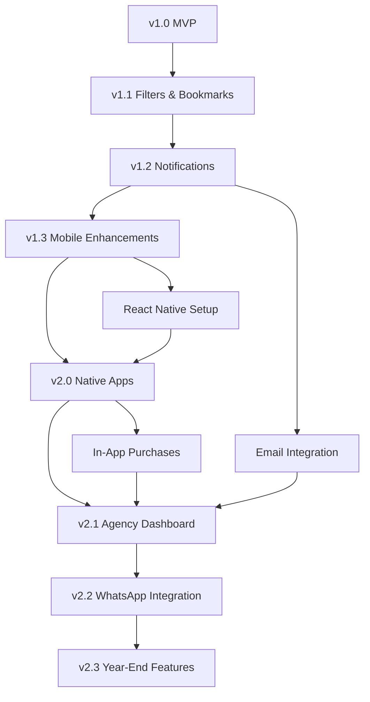

# Development Roadmap

**Path**: `docs/11-development-roadmap.md`
**Last Updated**: February 14, 2026
**Related**: [Product Vision](01-product-vision.md) | [Features](03-features.md) | [Testing & QA](12-testing-qa.md)

---

## Table of Contents
- [Overview](#overview)
- [Version History](#version-history)
- [Q1 2026 (Current Quarter)](#q1-2026-current-quarter)
- [Q2 2026](#q2-2026)
- [Q3 2026](#q3-2026)
- [Q4 2026](#q4-2026)
- [2027 and Beyond](#2027-and-beyond)
- [Technical Debt & Maintenance](#technical-debt--maintenance)

---

## Overview

This roadmap outlines the planned features, improvements, and milestones for BD Mariner Hub from February 2026 onwards.

### Development Philosophy

**Principles**:
- **User-Centric**: Build features users actually need, not what's technically cool
- **MVP First**: Ship minimum viable version, iterate based on feedback
- **Data-Driven**: Use analytics to prioritize features
- **Quality over Speed**: Better to ship polished features late than buggy ones early

**Release Cycle**:
- **Major Releases**: Quarterly (v1.1, v1.2, v1.3, v2.0)
- **Minor Releases**: Monthly (bug fixes, small features)
- **Hotfixes**: As needed (critical bugs)

---

## Version History

### v1.0 (MVP) - February 2026 ✅ Completed

**Release Date**: February 14, 2026
**Status**: Live in Production

**Features Delivered**:
- ✅ Job Board with Telegram integration
- ✅ AI-powered job parsing (8 SHIPPED fields)
- ✅ User authentication (email/password)
- ✅ Profile management
- ✅ Document management system
- ✅ Sea service tracker
- ✅ AI career assistant (Gemini chat)
- ✅ Medical centers directory
- ✅ Manning agents directory
- ✅ Community forum
- ✅ Alumni association
- ✅ Admin dashboard

**Technical Achievements**:
- React 19 + TypeScript
- Supabase backend (auth, database, storage, Edge Functions)
- Gemini 2.5 Flash AI integration
- Real-time updates
- PWA with offline support

**Metrics Achieved**:
- 92%+ job parsing accuracy
- <2s job listing load time
- 100% feature parity with initial spec

---

## Q1 2026 (Current Quarter)

### February 2026

**Focus**: Launch & Stabilization

**Completed**:
- ✅ MVP release (v1.0)
- ✅ Telegram bot deployment
- ✅ Initial user testing
- ✅ Bug fixes from early adopters

**In Progress**:
- 🔄 User onboarding improvements
- 🔄 Performance optimizations
- 🔄 Documentation completion

---

### March 2026

**Focus**: User Feedback & Quick Wins

**Planned Features** (v1.1):

**1. Advanced Job Filtering** (Priority: High)
- Filter by rank category (Deck, Engine, Ratings)
- Salary range slider ($0-$20,000)
- Joining date range picker
- Agency multi-select filter
- Vessel type filter (Tanker, Bulk, Container, etc.)
- Save filter presets

**2. Saved Jobs / Bookmarks** (Priority: High)
- Bookmark favorite jobs
- "My Saved Jobs" section
- Remove from saved
- Share saved jobs

**3. User Profile Enhancements** (Priority: Medium)
- Profile completeness indicator
- Rank preferences (target positions)
- Salary expectations
- Availability date
- Preferred vessel types
- Profile visibility settings (for alumni)

**4. Job Expiry Management** (Priority: Medium)
- Auto-expire jobs older than 60 days
- Manual expiry option for admins
- "Mark as Filled" option
- Expired jobs archive

**Engineering Work**:
- Database migration for new filters
- UI components for advanced filters
- Bookmark table and API
- Cron job for auto-expiry

**Success Metrics**:
- >50% of users use filters
- >30% of users bookmark jobs
- Job board load time <1.5s

---

## Q2 2026

### April 2026

**Focus**: Engagement & Retention

**Planned Features** (v1.2):

**1. Push Notifications** (Priority: High)
- Web push notifications (PWA)
- Job match alerts (based on profile preferences)
- Document expiry reminders (30 days before)
- Forum reply notifications
- Admin: Manual push for announcements

**2. Job Matching Algorithm** (Priority: High)
- AI analyzes user profile (rank, experience, preferences)
- "Jobs for You" personalized feed
- Match score (0-100%) for each job
- Email digest: Top 5 matched jobs weekly

**3. Enhanced Search** (Priority: Medium)
- Full-text search across job descriptions
- Search by MLA number
- Search by agency name
- Recent searches history

**4. User Activity Tracking** (Priority: Low)
- Track job views
- Track contact clicks
- Track time spent per job
- Admin: User behavior analytics

**Engineering Work**:
- Firebase Cloud Messaging integration (web push)
- Recommendation algorithm (cosine similarity on user vector)
- ElasticSearch or PostgreSQL full-text search
- Analytics events tracking

**Success Metrics**:
- >60% opt-in for notifications
- >40% users enable job matching
- 25% increase in job contact rate

---

### May 2026

**Focus**: Content & Community

**Planned Features** (v1.2.1):

**1. Enhanced Forum** (Priority: Medium)
- Markdown support in posts
- Image uploads in posts
- Post categories with icons
- Trending posts (most upvotes)
- "Best Answer" marking
- User reputation system (points for helpful posts)

**2. Blog / Resources Section** (Priority: Low)
- Career guides (written by team)
- Certificate renewal guides
- Interview tips
- Salary negotiation tips
- Published on main site, linked from app

**3. Email Notifications** (Priority: High)
- Welcome email (after sign-up)
- Weekly job digest (personalized)
- Document expiry warnings (30, 14, 7 days)
- Forum reply notifications
- Newsletter (monthly maritime news)

**Engineering Work**:
- SendGrid/Mailgun integration
- Email templates (responsive HTML)
- Unsubscribe management
- Blog CMS (possibly Strapi or Ghost)

**Success Metrics**:
- >70% email open rate
- >15% click-through rate
- >10% forum participation

---

### June 2026

**Focus**: Mobile Experience

**Planned Features** (v1.3):

**1. Native Mobile App Development Kickoff** (Priority: High)
- Technology selection (React Native vs Flutter)
- Initial prototype (key screens)
- Performance benchmarking
- Developer account setup (Apple, Google)

**2. PWA Enhancements** (Priority: Medium)
- Improved offline experience (cache 100 recent jobs)
- Background sync for pending actions
- Install banner optimization
- Home screen widget (Android)

**3. Mobile UI Refinements** (Priority: Medium)
- Bottom navigation bar
- Swipe gestures (swipe to bookmark job)
- Pull-to-refresh
- Skeleton loaders (better perceived performance)

**Engineering Work**:
- React Native setup
- Expo configuration
- Native module evaluation
- Service Worker improvements

**Success Metrics**:
- >80% mobile users
- >50% PWA install rate (of mobile users)
- <1.5s time-to-interactive (mobile)

---

## Q3 2026

### July 2026

**Focus**: Data & Insights

**Planned Features** (v1.4):

**1. Salary Insights** (Priority: Medium)
- Average salary by rank (chart)
- Salary trends over time (line graph)
- Comparison by vessel type
- Salary by flag state
- Market rate indicators

**2. Job Analytics Dashboard** (Priority: Low)
- Total jobs posted (monthly)
- Jobs by rank (pie chart)
- Jobs by agency (bar chart)
- Average salary trend
- Popular vessel types

**3. User Dashboard** (Priority: Medium)
- Application history (jobs contacted)
- Profile views (if public)
- Saved searches
- Activity timeline

**Engineering Work**:
- Chart library integration (Recharts or Chart.js)
- Aggregation queries for analytics
- Caching for dashboard performance

**Success Metrics**:
- >40% users view salary insights
- Dashboard load time <2s

---

### August 2026

**Focus**: Native Apps Beta

**Planned Features** (v2.0 Beta):

**1. Native Mobile Apps (iOS & Android)** (Priority: High)
- React Native app development
- Feature parity with PWA
- Native push notifications
- Biometric authentication (Face ID, fingerprint)
- Camera integration (scan documents)
- Share via native share sheet

**2. QR Code Scanner** (Priority: Medium)
- Scan CDC QR codes
- Auto-fill CDC number in profile
- Verify CDC authenticity

**3. Resume Builder** (Priority: Low)
- Template-based CV generator
- Pre-filled from profile data
- Export to PDF
- Multiple formats (Mariner Standard, European CV)

**Engineering Work**:
- React Native app (iOS & Android)
- Native camera access
- PDF generation (react-native-pdf)
- QR code library (jsQR)

**Success Metrics**:
- Beta testing with 500 users
- <1% crash rate
- 4.5+ star rating from beta testers

---

### September 2026

**Focus**: Native Apps Launch

**Planned** (v2.0 Public Release):

**1. App Store & Play Store Launch** (Priority: High)
- Submit to App Store (iOS)
- Submit to Play Store (Android)
- App Store Optimization (screenshots, descriptions)
- Launch marketing campaign

**2. In-App Purchases (Optional)** (Priority: Low)
- Premium features subscription
- Ad-free experience
- Priority job matching
- Extended AI chat quota

**3. Referral Program** (Priority: Medium)
- Share app with friends
- Both users get bonus (e.g., 1 month premium free)
- Leaderboard for top referrers

**Engineering Work**:
- App store submissions
- In-app purchase integration (RevenueCat)
- Referral tracking system

**Success Metrics**:
- 10,000 downloads (Month 1)
- 4.5+ star rating
- >20% organic referral rate

---

## Q4 2026

### October 2026

**Focus**: Monetization & Sustainability

**Planned Features** (v2.1):

**1. Agency Dashboard** (Priority: Medium)
- Manning agencies can create accounts
- Post jobs directly (without Telegram)
- View job analytics (views, applications)
- Manage job postings (edit, expire)
- Verified badge for paid accounts

**2. Premium Subscription (Optional)** (Priority: Low)
- Tier 1 (Free): Basic features
- Tier 2 ($2.99/month): Unlimited AI chat, priority support, ad-free
- Tier 3 ($9.99/month): Job matching, resume review, interview prep

**3. Job Application Tracking** (Priority: Medium)
- Track which jobs user applied to
- Status updates (Applied, Interview, Offer, Rejected)
- Notes on each application
- Statistics (applications, interviews, offers)

**Engineering Work**:
- Agency portal (admin interface for agencies)
- Stripe integration (subscriptions)
- Application tracking table

**Success Metrics**:
- 50 agency accounts created
- 10% users upgrade to premium
- $500/month revenue

---

### November 2026

**Focus**: WhatsApp Integration

**Planned Features** (v2.2):

**1. WhatsApp Business API Integration** (Priority: High)
- Monitor WhatsApp job groups (via WhatsApp Cloud API)
- Same parsing logic as Telegram
- Unified job feed (Telegram + WhatsApp + Manual)
- Broader coverage (more job sources)

**2. WhatsApp Notifications** (Priority: Medium)
- Job alerts sent via WhatsApp
- Document expiry reminders
- User can reply to manage preferences

**Engineering Work**:
- WhatsApp Business account verification
- WhatsApp Cloud API integration
- Webhook for WhatsApp messages
- Message template approval

**Success Metrics**:
- 50% more jobs aggregated
- >60% users opt-in for WhatsApp alerts

---

### December 2026

**Focus**: Year-End Features & Polish

**Planned Features** (v2.3):

**1. Interview Preparation** (Priority: Low)
- Common interview questions (by rank)
- Sample answers
- AI mock interview (chat-based)
- Feedback on answers

**2. Maritime News Feed** (Priority: Low)
- Curated maritime industry news
- Regulation updates
- Safety bulletins
- Company announcements

**3. Year-End Statistics** (Priority: Low)
- "Your 2026 in Review"
- Jobs viewed, documents uploaded, sea time added
- Shareable infographic

**Engineering Work**:
- News aggregation API (RSS feeds)
- Interview Q&A database
- Year-end stats generator

**Success Metrics**:
- 20,000 MAU by year-end
- 4.7+ star rating
- Featured in App Store/Play Store

---

## 2027 and Beyond

### Q1 2027: International Expansion

**Features**:
- Multi-language support (Bengali, Hindi, Tagalog)
- Support for other countries (India, Philippines, Indonesia)
- Currency conversion (salary in local currency)
- Regional job boards

---

### Q2 2027: Advanced AI

**Features**:
- AI resume review and suggestions
- AI interview practice (voice-based)
- Predictive job recommendations
- Salary negotiation assistant

---

### Q3 2027: Marketplace

**Features**:
- Training course marketplace (STCW, safety courses)
- Document services (CDC renewal agencies)
- Accommodation during CDC renewal
- Flight booking integration

---

### Q4 2027: Enterprise Features

**Features**:
- Bulk hiring for ship owners
- Crew management system integration
- Contract management
- Compliance tracking

---

## Technical Debt & Maintenance

### Ongoing Tasks (Every Quarter)

**Code Quality**:
- Refactor complex components
- Improve test coverage (target: 80%)
- Update dependencies (security patches)
- Code reviews for all PRs

**Performance**:
- Database query optimization
- Bundle size reduction
- Image optimization
- CDN implementation

**Security**:
- Penetration testing (annual)
- Dependency vulnerability scanning
- API key rotation (every 90 days)
- RLS policy audit

**Documentation**:
- Keep docs in sync with code
- API documentation updates
- User guides and tutorials
- Developer onboarding guide

---

### Maintenance Schedule

**Daily**:
- Monitor error logs (Sentry)
- Check database health
- Review user feedback

**Weekly**:
- Dependency updates (patch versions)
- Performance metrics review
- User analytics review

**Monthly**:
- Security audit
- Database backup verification
- Load testing
- User survey

**Quarterly**:
- Major dependency updates
- Architecture review
- Capacity planning
- Team retrospective

---

## Feature Prioritization Framework

### MoSCoW Method

**Must Have** (Blocker for release):
- Core job board functionality
- User authentication
- Job parsing (AI)

**Should Have** (Important but not critical):
- Advanced filters
- Push notifications
- Job matching

**Could Have** (Nice to have):
- Salary insights
- Resume builder
- Interview prep

**Won't Have** (Out of scope):
- Video interviews
- Direct hiring
- Payroll integration

---

### RICE Scoring

**Formula**: (Reach × Impact × Confidence) / Effort

**Example**: Push Notifications
- Reach: 80% of users (8/10)
- Impact: High - drives retention (8/10)
- Confidence: Very confident (9/10)
- Effort: 3 weeks (6/10)

**RICE Score**: (8 × 8 × 9) / 6 = 96 (High priority)

---

## Dependency Map

---

## Release Checklist

### Pre-Release

- [ ] All features implemented
- [ ] Unit tests passing
- [ ] Integration tests passing
- [ ] Performance benchmarks met
- [ ] Security review completed
- [ ] Documentation updated
- [ ] Changelog written
- [ ] Beta testing completed

### Release Day

- [ ] Deploy to production
- [ ] Monitor error rates
- [ ] Check database performance
- [ ] Verify Edge Functions
- [ ] Test critical user flows
- [ ] Announce release (social media, email)

### Post-Release

- [ ] Monitor user feedback
- [ ] Track key metrics
- [ ] Fix critical bugs within 24h
- [ ] Plan next release
- [ ] Team retrospective

---

## Related Documentation
- **[Product Vision](01-product-vision.md)** - Long-term vision
- **[Features](03-features.md)** - Feature specifications
- **[Testing & QA](12-testing-qa.md)** - Quality assurance
- **[Analytics & Metrics](13-analytics-metrics.md)** - Success measurement

---

**Next**: [Testing & QA](12-testing-qa.md)
